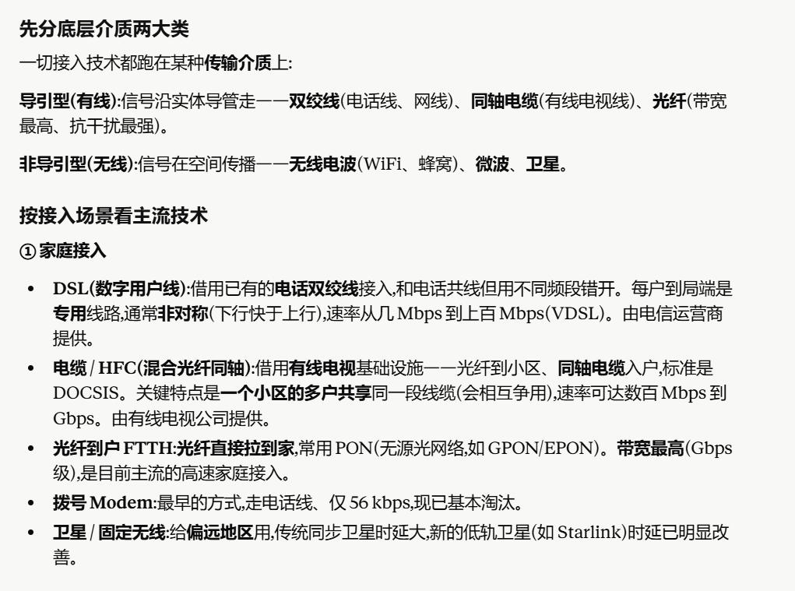
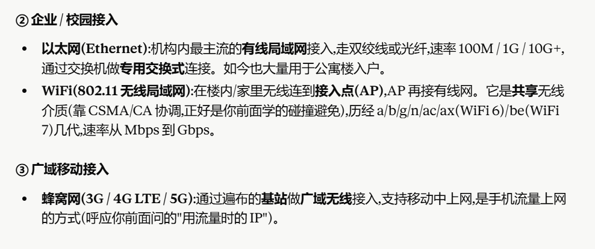

# Focus
网络体系结构的概念，是什么东西
网络的层与层之间怎么交互的
osi模型 几层 tcp/ip模型 几层 区别是什么

物理层解决什么问题，传输介质是什么，双绞线、电缆、光纤（好处）
物理层接入的技术包括什么（什么东西在传输会用到什么接入技术）
物理层的延时的概念（传输时延、传播时延等）

CSMA/CD（最短帧长） 用于冲突的检测
数据链路层解决什么问题，数据链路层的功能是什么
帧和MAC地址
以太网帧 以太网交换机是通过什么进行转发的
广播的信道 多路访问信道
ARP协议的功能是什么 为什么要设置ARP
链路层丢帧的处理 差错控制

网络层解决什么问题，网络层的功能是什么
如何进行转发的
IP提供无连接服务还是有连接服务
ICMP 以及和IP的关系
最长前缀匹配
子网的划分方式（划分子网，满足地址数量的最小的划分方法）
路由表（如何填充，如何转发）
子网掩码
路由聚合的概念（两个子网合并），有什么好处
NAT是怎么做的
路由算法非常重要 距离向量算法 是怎么做的 思想是什么 如何进行计算（更新距离向量）
链路状态算法 核心思想是什么 与DV算法的区别

传输层解决什么问题，有什么功能
可靠传输依靠什么机制
TCP的序列号和ACK的序列号（确认号），知道如何计算
go back n机制（协议）是怎么做的
发送窗口 报文段长度 RTT 信道带宽 之间的关系
最大的平均速率 由什么决定
超时重传 什么时候触发，怎么做的，和NAK的关系
思考NAK和超时重传是否都需要？有一个是不是就够了？
TCP拥塞窗口的调整（拥塞处理机制，AIMD的处理方式） 调整的时候窗口什么时候减半，什么时候降为1
TCP的累计确认ACK 是怎么做的

应用层：如果要访问google，每一层该怎么做 可能是其他应用，要进行交互，从应用往下层走，用不同的模型(osi或者TCP/IP)讲清楚不同层在其中做了什么

# Intro
## 传输介质


物理层是五层模型的最底层,它解决的问题可以浓缩成一句话:怎么把比特(0 和 1)真正地、以物理信号的形式,从一个节点送到相邻节点
- 比特怎么变成信号？
- 用什么介质传？
| 介质                       | 说明                                                  | 典型速率/用途   |
| -------------------------- | ----------------------------------------------------- | --------------- |
| **双绞线（TP）**     | 两根绝缘铜线绞合，便宜，安装简单     | 以太网          |
| **同轴电缆（Coax）** | 两层同心铜导体，双向，宽带；抗干扰能力强， 带宽高               | 有线电视/HFC    |
| **光纤（Fiber）**    | 玻璃纤维传输光脉冲，带宽极高，低误码率，抗电磁干扰 | 骨干网、长距离  |
| **无线电（Radio）**  | 电磁波，无需物理线缆，受反射/遮挡/干扰影响            | Wi-Fi, 4G, 卫星 |

## 两种层次模型
### 为什么需要分层？

- 每一层向上层提供服务,同时使用下一层提供的服务;
- 层与层之间通过明确的接口交互,一层的内部实现可以随便改,只要接口不变,别的层不受影响;
- 对等层之间遵循共同的协议通信

网络极其复杂（hosts, routers, links, apps, protocols, software, hardware...），分层的好处：

1. **显式结构**：方便识别各部分关系，建立参考模型
2. **模块化**：每层独立维护，修改一层不影响其他层

**分层优缺点**：

- **优点**：降低复杂度，提高灵活性
- **缺点**：引入额外开销（每层加header）；有时需要跨层信息（cross-layer information）

### OSI参考模型（7层）
由ISO开发，理论完整但**来得太晚，基本没人用**——当它推出时TCP/IP已经广泛部署了。
```
┌─────────────────┐
│  7. Application │ ← 应用程序接口（"请你吃饭"）
├─────────────────┤
│  6. Presentation│ ← 数据表示/编码/加密（"用什么语言"）→ 现已并入Application
├─────────────────┤
│  5. Session     │ ← 会话控制/同步（"听说同步"）→ 现已并入Application
├─────────────────┤
│  4. Transport   │ ← 端到端可靠传输（"摘机拨号"）
├─────────────────┤
│  3. Network     │ ← 多网络间路由（"PBX中转"）
├─────────────────┤
│  2. Data Link   │ ← 相邻节点间帧传输（"信号传输"）
├─────────────────┤
│  1. Physical    │ ← 比特流传输（"插口、双绞线"）
└─────────────────┘
```

各层职责：

- **Physical**：传输比特，规定机械/电气/光学特性（电缆、插头、信号强度）
- **Data Link**：将比特组成帧（frames），检错/纠错，介质访问控制（MAC）
- **Network**：多链路/多网络间的包传输，路由算法，转发
- **Transport**：端到端数据交换（进程到进程），可靠流传输（无错、有序、无损、无重复）
- **Session/Presentation/Application**：现在已合并到应用层

### TCP/IP协议栈（5层，互联网实际使用，重要）

```
┌───────────────────┐    协议举例：
│  5. Application   │ ←  HTTP, SMTP, DNS, FTP
├───────────────────┤
│  4. Transport     │ ←  TCP, UDP
├───────────────────┤
│  3. Network       │ ←  IP（只有一个！）
├───────────────────┤
│  2. Data Link     │ ←  Ethernet, WiFi(802.11), PPP
├───────────────────┤
│  1. Physical      │ ←  Optical, Copper, Radio
└───────────────────┘
```

## 网络时延
