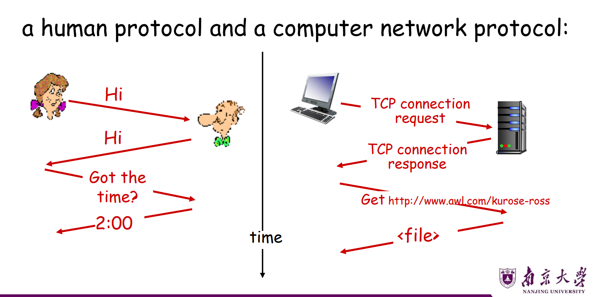
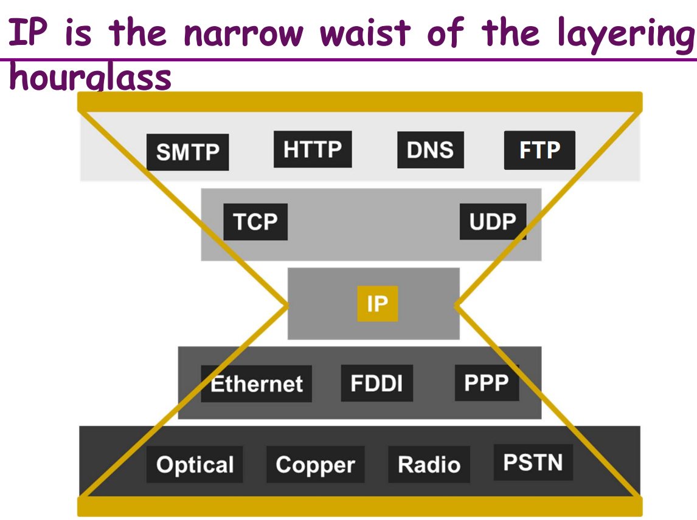
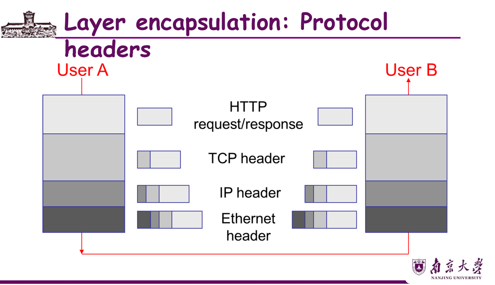
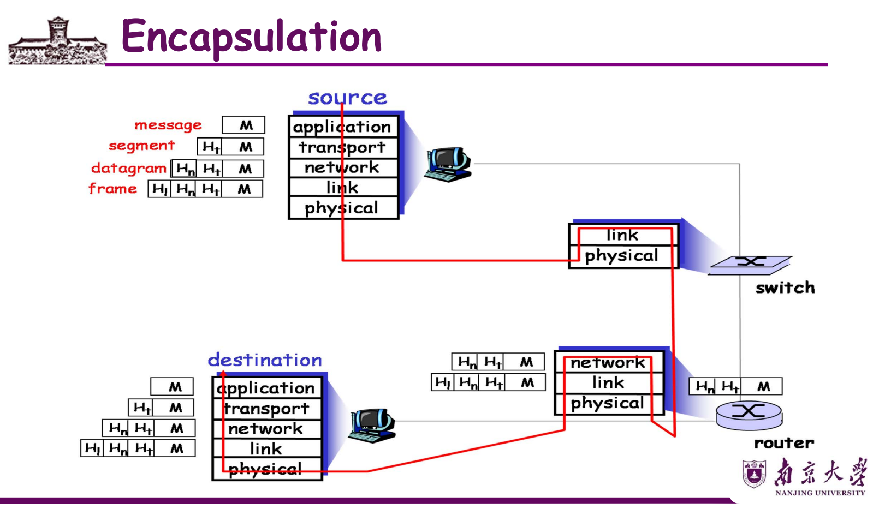
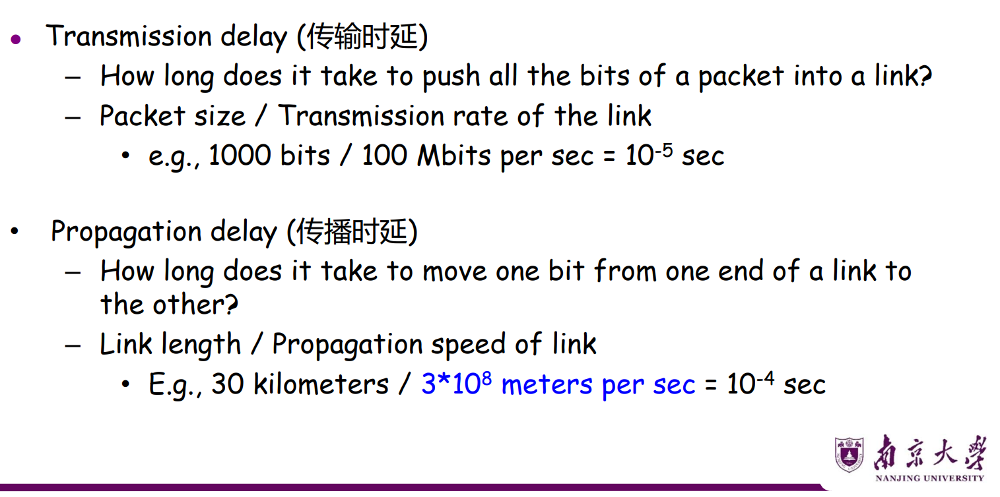
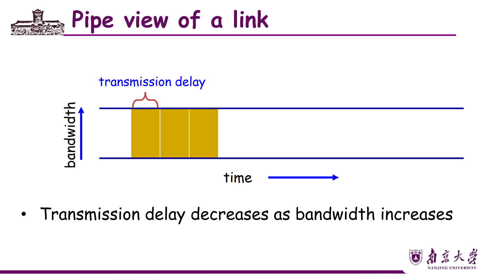
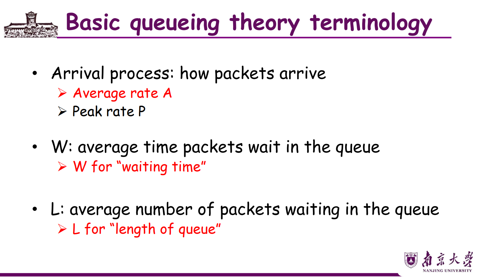
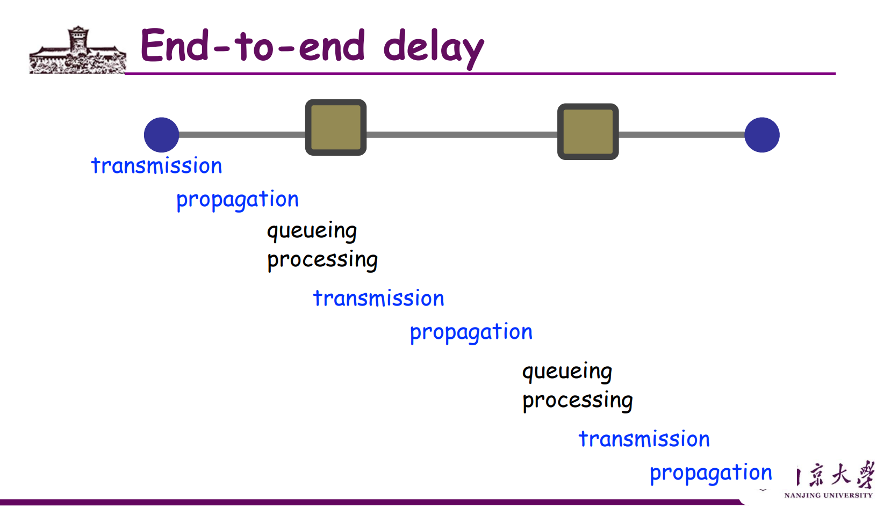

# Basic Concepts

### Internet

network: a **system of links** that connect nodes together to move information from one place to another

Internet: a **network of networks** that connects millions of computers together, allowing them to communicate and share information

Internet的规模（MASSIVE Scale）：

- 35亿用户（世界人口34%）
- 1万亿个网站
- 每天2000亿封邮件
- 20亿部智能手机
- 路由器每秒处理10 Terabits的数据

---

## What is Internet Made of?

### Component View（组成视角）

```
                        Mobile network
                       ┌──────────────┐
                       │  📱 laptop   │
                       │      🚗      │         Global ISP
                       └──────┬───────┘       ┌──────────┐
                              │               │  [R][R]  │
                Home network  │  Regional ISP │  [R][R]  │
              ┌──────────────┐│┌────────────┐ └──────────┘
              │ 💻 📱        ││ │  [R]  [R]  │
              │     [AP]     ├┘ │  [R]  [R]  │
              └──────────────┘  └────────────┘
                              Institutional network
                             ┌──────────────────────┐
                             │ [X][X]   💻💻💻    │
                             │ [X][X]   🖨️server   │
                             └──────────────────────┘
```

三大组成部分：

- **Computing devices（主机/端系统）**：hosts = end systems，运行网络应用程序（laptops, phones, servers等）
- **Communication links（通信链路）**：Fiber, Copper, Radio, Satellite，构建物理网络
- **Routers（路由器）**：在物理网络之间转发 **packets**（数据块、包）

---

## What are Protocols?

### 人类协议 vs 网络协议



**Protocol（协议）**：定义网络实体之间收发消息的**格式（format）**、**顺序（order）**，以及消息收发时所采取的**动作（actions）**。

or: 2 key aspects: **semantics and timing** (语义和时序)

> 类比理解：就像人与人交流需要遵守礼仪（先打招呼，再问问题），计算机通信也需要协议来规定"怎么开始对话、怎么请求数据、怎么结束"。

**Internet standards** 由 **IETF**（Internet Engineering Task Force）发布，以 **RFC**（Request for Comments）文档形式存在。

Internet = **"network of networks"**：

---

## Reliability of Communication：蓝军-白军问题

> 这是一个经典的思想实验，说明**可靠通信的本质困难**。

**场景**：蓝军A和蓝军B占据东西两个山顶，白军驻扎山谷中间。单独任一蓝军打不赢白军，但协同进攻可以取胜。通信兵必须穿过白军营地，**可能被截获**。

```
     蓝军A                              蓝军B
      🏔️                                🏔️
       │                                 │
       │──── "明日正午进攻，如何？" ────►│
       │◄─── "同意" ──────────────────── │
       │──── "收到'同意'" ────────────►  │
       │◄─── "收到：收到'同意'" ──────── │
       │         ...无限循环...          │
            中间是白军营地 🏳️
```

**结论**：这样的协议**无法实现100%的胜利保证**！无论发多少轮确认，最后一条消息的发送方永远不能确定对方是否收到。

> 这就是网络中的**两将军问题**，证明了在不可靠信道上无法实现完美的协调。这也是为什么TCP只能做到"尽力可靠"，而无法做到绝对保证。

---

## Q2: How to Connect to Internet?

三层结构：

```
        ┌─────────────────────────────┐
        │    Network Edge（网络边缘）   │  ← 应用和主机
        └─────────────┬───────────────┘
                      │
        ┌─────────────▼───────────────┐
        │  Access Networks（接入网络） │  ← 物理介质，有线/无线
        └─────────────┬───────────────┘
                      │
        ┌─────────────▼───────────────┐
        │    Network Core（网络核心）  │  ← 互联的路由器
        └─────────────────────────────┘
```

### Network Edge（网络边缘）

End systems（主机）：运行应用程序，如Web浏览器、邮件客户端等。

两种应用模型：

- **Client-Server model**：客户端向常驻服务器请求服务（网页浏览、邮件）
  ```
  Client ──请求──► Server（always on）
         ◄──响应──
  ```
- **Peer-to-Peer (P2P) model**：几乎不使用或完全不使用专用服务器（Skype, BitTorrent）
  ```
  Peer A ◄──────► Peer B
    ▲                 ▲
    └──────────────────┘
  互相直连，无需中央服务器
  ```

### Access Networks（接入网络）

问题：如何将端系统连接到**边缘路由器（edge router）**？

#### 家庭接入（Residential Access）

| 技术                          | 速率                        | 特点                                                       |
| ----------------------------- | --------------------------- | ---------------------------------------------------------- |
| **拨号（Dialup）**      | ≤56 Kbps                   | 占用电话线，不能同时上网和打电话                           |
| **DSL**（数字用户线路） | 上行≤1 Mbps，下行≤8 Mbps  | 由电话公司提供，**专用**物理线路到中心局             |
| **HFC**（混合光纤同轴） | 下行≤30 Mbps，上行≤2 Mbps | 由有线电视公司提供，**共享**接入（邻居共用同一线路） |

> **DSL vs HFC的关键区别**：DSL是专线（dedicated），每户独享带宽；HFC是共享（shared），邻居多了会变慢。

**典型家庭网络结构**：

```
  互联网
    │
    ▼
[Cable Modem] ──► [Router/Firewall/NAT] ──► [Ethernet Switch] ──► 有线PC
                          │
                          ▼
                   [Wireless AP] ──► 笔记本、手机（Wi-Fi）
```

#### 企业/学校接入（Institutional Access：LAN）

- **以太网（Ethernet）**：10Mbps / 100Mbps / 1Gbps / 10Gbps
- 端系统通过以太网交换机（Ethernet switch）的骨干网连接
- 现代配置：端系统直接连接到以太网交换机

```
  Router ──── Switch ──── PC×多台
                  └────── Server×多台
```

#### 无线接入（Wireless Access）

- **Wireless LANs（无线局域网）**：802.11b/g (Wi-Fi)，11或54 Mbps，通过接入点（AP）连接
- **Wide-area wireless（广域无线）**：3G/4G（LTE, WiMax），覆盖数十公里，1~10 Mbps

```
手机/笔记本 ──(无线)──► Access Point ──► Router ──► Internet
```

### Physical Media（物理介质）

```
                  ┌── 铜线（双绞线 TP）
  导向介质 ──────┤── 同轴电缆（Coaxial）
（Guided media） └── 光纤（Fiber optic）

                  ┌── 地面微波
非导向介质 ───────┤── Wi-Fi（局域网无线）
（Unguided media）├── 蜂窝网络（3G/4G）
                  └── 卫星
```

| 介质                       | 说明                                                  | 典型速率/用途   |
| -------------------------- | ----------------------------------------------------- | --------------- |
| **双绞线（TP）**     | 两根绝缘铜线绞合，Cat5=100Mbps/1Gbps，Cat6=10Gbps     | 以太网          |
| **同轴电缆（Coax）** | 两层同心铜导体，双向，宽带（多路复用）                | 有线电视/HFC    |
| **光纤（Fiber）**    | 玻璃纤维传输光脉冲，10~100 Gbps，低误码率，抗电磁干扰 | 骨干网、长距离  |
| **无线电（Radio）**  | 电磁波，无需物理线缆，受反射/遮挡/干扰影响            | Wi-Fi, 4G, 卫星 |

> **卫星通信特点**：延迟高（~270ms），因为信号要飞到太空再回来（约36000km的地球同步轨道）。

---

## Q3: How to Transfer Data?

### 为什么用 Switched Network？

如果N个节点**直接两两相连**，需要 **N²条链路**！不可扩展。

解决方案：用**交换机/路由器**作中转，节点只需连接到最近的交换机：

```
直连（4节点需要6条链路）：    交换网络（只需4条链路）：
A──B                           A
|\/|                           │
|/\|                          [Switch]
C──D                          / │ \
                             B  C  D
```

### 两种共享网络方式

#### Circuit Switching（电路交换）

**核心思想**：通信前先**预留**一条专用路径，通信结束后释放。

**工作流程**：

```
1. src 发送预留请求 ──────────────────► dst
2. 交换机执行接纳控制，建立电路 (checks: 10 Mbps available?)
3. src 发送数据 ─────────────────────► dst
4. src 发送拆除请求（释放资源）
```

**交换机内部**：预留时在交换机内部建立一条物理通路：

```
      Switch
  src ──●────●── (其他)
        │
  (其他)──●────●── dst  ← 建立了src到dst的专用内部连接
```

**Pros（优点）**：

- 性能可预测（guaranteed performance）
- 电路建立后转发简单快速

**Cons（缺点）**：

- 电路建立/拆除复杂，增加延迟
- 资源专用：**流量突发时浪费**（预留了10Mbps但数据只用了1Mbps）
- 一个交换机故障 → 整条电路失败

> 典型例子：**电话网络**。打电话时，从你到对方的整条路径都被预留。

#### Packet Switching（分组交换）

**核心思想**：数据被切成一个个**数据包（packet）**，每个包独立路由，**按需共享**资源。

```
每个Packet结构：
┌───────────┬──────────────────────────────┐
│  Header   │          Data                │
│(目标地址等)│                              │
└───────────┴──────────────────────────────┘
```

**Store and Forward（存储转发）**：每个路由器收到整个包后，再转发给下一跳：

```
src ──[packet]──► Router1 ──[packet]──► Router2 ──[packet]──► dst
      存入buffer         存入buffer
      查路由表           查路由表
      转发                转发
```

**拥塞（Congestion）与队列（Queue）**：

当A（100Mb/s）和B都往只有1.5Mb/s出口的路由器发包时：

```
A (100Mb/s) ──►┐
               ├──► [Router] ──► 1.5Mb/s ──► 目的地
B        ────►─┘        ↑
                    排队等待的数据包（queue）
                    队列满了就丢包（packet loss）！
```

**Pros（优点）**：

- **高效利用**网络资源（统计多路复用）
- 实现更简单
- 健壮：可以绕路（route around trouble）

**Cons（缺点）**：

- 性能不可预测（unpredictable delay）
- 需要缓存管理和拥塞控制

#### Statistical Multiplexing（统计多路复用）

分组交换的关键原理：**按需共享带宽**。

**例子**：10Mbps链路，N个用户，每人需要1Mbps，每人10%时间活跃：

- **电路交换**：最多支持 10Mbps/1Mbps = **10个用户**
- **统计多路复用**：假设N=35，同时超过10人活跃的概率仅为0.04%，所以99.96%的时间每人都有≥1Mbps带宽 → 可以支持**35个用户**！

> **直觉**：就像银行开了10个窗口但有35个客户，因为不是所有人同时来办业务，所以也能正常运转。

#### Virtual Circuit（虚电路）—— 混合方式

结合电路交换和分组交换的优点：

- **路径固定**（像电路交换）：预先确定路由路径
- **资源共享**（像分组交换）：带宽按需分配，仍用packets传输
- 资源可以被**预留**，从而保证不同的服务质量

#### 三种方式对比

|                    | 电路交换             | 数据报分组交换         | 虚电路分组交换          |
| ------------------ | -------------------- | ---------------------- | ----------------------- |
| **传输通路** | 专用                 | 非专用                 | 非专用                  |
| **带宽**     | 固定                 | 动态使用               | 动态使用                |
| **路由**     | 固定                 | 动态                   | 固定                    |
| **时延**     | 实时（只有建立时延） | 分组传输时延           | 传输时延+建立时延       |
| **扩展性**   | 差（有接入上限）     | 好（用户数可动态扩充） | 较好（拥塞控制保证QoS） |

---

## Protocol Layers and Service Model（协议层次）

### 为什么需要分层？

网络极其复杂（hosts, routers, links, apps, protocols, software, hardware...），分层的好处：

1. **显式结构**：方便识别各部分关系，建立参考模型
2. **模块化**：每层独立维护，修改一层不影响其他层（类比：修改登机手续不影响飞行路线）

**航空类比**：乘客从A城飞到B城，经历多个"层"：购票→托行李→登机口→起飞→飞行路线→降落→取行李→投诉。每一层处理一件事，依赖下层服务。

**分层优缺点**：

- **优点**：降低复杂度，提高灵活性
- **缺点**：引入额外开销（每层加header）；有时需要跨层信息（cross-layer information）

### 两大标准协议架构

#### OSI参考模型（7层）

由ISO开发，理论完整但**来得太晚，基本没人用**——当它推出时TCP/IP已经广泛部署了。

```
┌─────────────────┐
│  7. Application │ ← 应用程序接口（"请你吃饭"）
├─────────────────┤
│  6. Presentation│ ← 数据表示/编码/加密（"用什么语言"）→ 现已并入Application
├─────────────────┤
│  5. Session     │ ← 会话控制/同步（"听说同步"）→ 现已并入Application
├─────────────────┤
│  4. Transport   │ ← 端到端可靠传输（"摘机拨号"）
├─────────────────┤
│  3. Network     │ ← 多网络间路由（"PBX中转"）
├─────────────────┤
│  2. Data Link   │ ← 相邻节点间帧传输（"信号传输"）
├─────────────────┤
│  1. Physical    │ ← 比特流传输（"插口、双绞线"）
└─────────────────┘
```

各层职责：

- **Physical**：传输比特，规定机械/电气/光学特性（电缆、插头、信号强度）
- **Data Link**：将比特组成帧（frames），检错/纠错，介质访问控制（MAC）
- **Network**：多链路/多网络间的包传输，路由算法，转发
- **Transport**：端到端数据交换（进程到进程），可靠流传输（无错、有序、无损、无重复）
- **Session/Presentation/Application**：现在已合并到应用层

#### TCP/IP协议栈（5层，互联网实际使用，重要）

```
┌───────────────────┐    协议举例：
│  5. Application   │ ←  HTTP, SMTP, DNS, FTP
├───────────────────┤
│  4. Transport     │ ←  TCP, UDP
├───────────────────┤
│  3. Network       │ ←  IP（只有一个！）
├───────────────────┤
│  2. Data Link     │ ←  Ethernet, WiFi(802.11), PPP
├───────────────────┤
│  1. Physical      │ ←  Optical, Copper, Radio
└───────────────────┘
```

### IP是分层沙漏的"细腰"



```
      SMTP  HTTP  DNS  FTP      ← 多种应用层协议
       │    │    │    │
      ╔══════════════════╗
      ║    TCP    UDP    ║      ← 多种传输协议
      ╠══════════════════╣
      ║       IP         ║      ← 只有一种网络层协议（细腰！）
      ╠══════════════════╣
      ║ Ethernet WiFi PPP║      ← 多种链路层技术
      ╠══════════════════╣
      ║ Optical Copper...║      ← 多种物理介质
      ╚══════════════════╝
```

**为什么IP是细腰（narrow waist）？**

- 只要支持IP，任何网络技术都能互通（任意底层连接任意上层应用）
- **解耦**应用与底层网络技术
- 但修改IP本身很难（IPv4→IPv6的推进已花了几十年），很难演进
- 通信双方要有相同协议

### 协议头

Protocol header（协议头）：每层协议都在数据前面加一个header，包含该层需要的控制信息（如目的地址、序列号等），以便正确处理和转发数据。


### Protocol Data Unit（协议数据单元）

每一层处理的数据单元称为Protocol Data Unit（PDU）。例如：

- Application层的PDU叫Message（消息）
- Transport层的PDU叫Segment（段）
- Network层的PDU叫Datagram（数据报）

### Layer Encapsulation（层封装）

每经过一层，就在数据前面加一个**header（头部）**，包含该层需要的控制信息：


---

## Network Performance（网络性能）

### 三大性能指标

1. **Delay（延迟）**：数据包从源到目的地需要多长时间？
2. **Loss（丢包率）**：发送的数据包有多少比例被丢弃？
3. **Throughput（吞吐量）**：目的地以多快的速率接收数据？

### Delay（延迟）的四个组成部分

```
              传输时延                          传输时延
              (transmission)
源端 ────────────────────────[Router1]──────────────────[Router2]──────── 目的端
     ←─────────────────────►         ←──────────────►
         传播时延                          传播时延
         (propagation)         ↑
                          排队+处理时延
                          (queuing+processing)
```

| 延迟类型                                 | 定义                                                                  | 公式                                   | 影响因素     |
| ---------------------------------------- | --------------------------------------------------------------------- | -------------------------------------- | ------------ |
| **Transmission delay（传输时延）** | 把包的所有bit推入链路需要多长时间<br />和设备调制能力相关             | 包大小L / 链路带宽R                    | 链路带宽     |
| **Propagation delay（传播时延）**  | 一个bit从链路一端传到另一端的时间<br />速度是在光速量级的，和距离相关 | 链路长度d / 传播速度v（≈3×10⁸ m/s） | 链路物理长度 |
| **Queuing delay（排队时延）**      | 包在路由器缓冲区等待的时间                                            | 取决于流量模式                         | 网络拥塞程度 |
| **Processing delay（处理时延）**   | 路由器处理包头、查路由表的时间                                        | 通常可忽略不计                         | —           |

**举例**：发送100字节(800 bits)的包，链路带宽1Mbps，传播时延1ms

- 传输时延 = 800 / 10⁶ = 0.8ms
- 传播时延 = 1ms
- **总延迟 = 1.8ms**

若带宽升至1Gbps：传输时延 = 800/10⁹ ≈ 0.0008ms，总延迟 ≈ 1.0008ms（传播时延主导）

> **关键直觉**：带宽提升后传输时延可以忽略，**传播时延（取决于物理距离）** 成为瓶颈。这就是为什么即使网络带宽很高，ping一台远程服务器仍有延迟。




### Queuing Delay（排队时延）详解
How long a packet needs to wait in a queue in the buffer before being transmitted.
```
两条输入流 ──►┐
              ├──► [Switch/Router] ──► 输出链路
两条输入流 ──►┘         ↑
                   Queue（缓冲区）
```

- **无过载时**：包直接通过，无排队
- **瞬时过载（Transient Overload）**：输入速率 > 输出速率，包排队等待（**这很常见！**）
- **持续过载**：队列满了，新包被**丢弃（dropped/lost）** ← 产生 packet loss

排队时延的特征用统计量描述：

- 平均排队时延（W）（均值）
- 排队时延**方差**
- 超过阈值的概率（丢包率）



**Little's Law（利特尔定律，1961）**：**L = A × W**

- L：队列中平均包数
- A：平均到达速率（包/秒）
- W：包在队列中平均等待时间

> **用途**：L容易直接测量，W难以测量，用 W = L/A 间接计算等待时间。


端到端delay不是直接相加，是有流水线的：
前面的包在传播时，后面的包可以同时传输和排队，所以总延迟不等于每跳延迟之和，而是取决于最长的那条路径。
### Loss（丢包）

丢包率 = 被丢弃的包数 / 总发送包数

- 原因：路由器缓冲区满了，新到达的包被丢弃
- 由上层协议（如TCP）负责重传

### Throughput（吞吐量）

吞吐量：目的地**实际接收**数据的速率（bits/sec）

**单链路**：吞吐量 ≈ 链路传输速率R（忽略传播延迟）

**多跳路径**：吞吐量由**瓶颈链路（bottleneck link）**决定

```
Source ──R Mbps──► [Router] ──R' Mbps──► Destination

Average throughput = min{R, R'} = 最小链路速率
```

> **比喻**：就像水管，最终流量取决于最细的那段管子。
