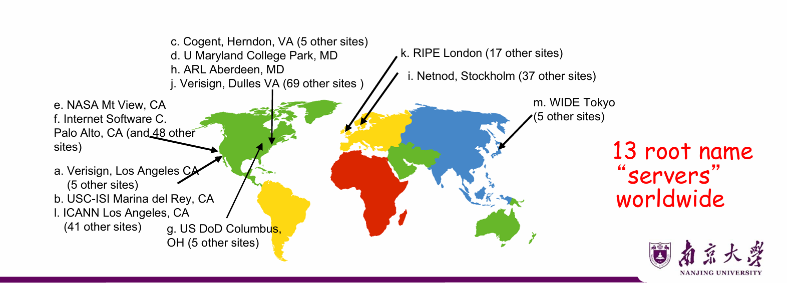

# Lec2: Internet Applications

## Internet Applications Overview

**Application（应用）**：运行在端系统（end systems）上的、互相通信的分布式进程(processes)

- 例如：Email, Web, P2P文件共享
- 只运行在端系统上，**不运行**在网络核心设备（服务器）上
- 进程之间**交换消息**（exchange messages）来实现应用功能


**Application-layer protocols（应用层协议）**：

- 是应用程序的一个部分
- 定义应用之间**交换的消息类型和动作**
- 使用下层协议（TCP, UDP等）提供的通信服务（传输层协议）来传输消息

---

### 典型互联网应用一览

| Application          | App-Layer Protocol         | Transport Protocol |
| -------------------- | -------------------------- | ------------------ |
| Email                | SMTP [RFC 2821]            | TCP                |
| Remote terminal      | Telnet [RFC 854]           | TCP                |
| Web                  | HTTP [RFC 2616]            | TCP                |
| File transfer        | FTP [RFC 959]              | TCP                |
| Streaming multimedia | Proprietary (e.g. RealNetworks) | RTP, TCP or **UDP** |
| Internet telephony   | Proprietary (e.g. Dialpad) | SIP on **UDP**     |

> 注意：实时性要求高的应用（流媒体、网络电话）倾向于使用UDP，因为它延迟低，不强制重传。

---

## 应用层关键术语（Jargons）

### Process（进程）
**Process**：运行在某台主机内的程序

- **同一主机**的两个进程通信：使用**操作系统**提供的**进程间通信（IPC）**机制
- **不同主机**的两个进程通信：使用**应用层协议**

### User Agent（用户代理）

- **User agent**：介于用户界面（"上层"）和网络（"下层"）之间的**接口**
- 实现用户界面 + 应用层协议，例如：
  - Web：浏览器（browser）、Web服务器
  - Email：邮件客户端、邮件服务器
  - 流媒体：媒体播放器、媒体服务器

### socket（套接字）
- **socket**：应用层与传输层之间的接口，提供**进程间通信**的抽象
- 进程通过 socket 发送/接收消息，socket 负责调用传输层协议（TCP/UDP）来传输消息

---

## App-Layer Protocol 定义了什么？

| 要素 | 含义 | 例子 |
|------|------|------|
| **Types**（消息类型） | 交换哪些种类的消息 | request / response |
| **Syntax**（语法） | 消息包含哪些字段，字段如何分隔 | HTTP header格式 |
| **Semantics**（语义） | 字段的含义是什么 | 状态码200=OK |
| **Rules**（规则） | 进程何时、如何发送/响应消息 | 先发GET，再收200 |

---

## Application Architectures（应用架构）
应用架构由app研发者设计，规定如何在各种端系统上部署应用进程，以及它们如何通信。

两种主要结构：**Client-Server（CS）** 和 **Peer-to-Peer（P2P）**

### Client-Server Paradigm（客户端-服务器模式）

```
        Client A ──request──►┐
        Client B ──request──►├──► Server（always-on）
        Client C ──request──►┘       │
                            ◄──reply─┘
```

**Client（客户端）**：
- 按需启动（start as required）
- 主动发起连接，"先开口"（speaks first）
- IP地址可以是动态的
- 例子：Web浏览器、邮件客户端

**Server（服务器）**：总是打开，等待客户端连接
- 以守护进程方式**常驻运行**（run as daemon, always-on）
- 响应客户端请求，提供服务
- 拥有**固定的永久IP地址**
- 例子：Web服务器发送网页，邮件服务器投递邮件

---

### Peer-to-Peer Paradigm（点对点模式）

```
  Peer A ◄──────────────────► Peer B
    ▲                              ▲
    │                              │
    └──────────────────────────────┘
              peer-peer
    ▲                              ▲
    └──────────────────────────────┘
  Peer C ◄──────────────────► Peer D
```

- **没有**常驻服务器
- 任意端系统**直接互相通信**
- 每个peer**既请求服务，又提供服务**
- **自扩展性（self scalability）**：新加入的peer带来新的服务能力，也带来新的工作负载
- Peer的IP地址是**间歇性连接且可变**的 → 高度可扩展，但难以管理
- 例子：Gnutella、文件共享应用BitTorrent

---

### 混合模式：CS + P2P

现实中很多应用是两者混合的：

| 应用 | P2P部分 | CS部分 |
|------|---------|--------|
| **Skype** | 用户之间的语音通话（直连） | 中央服务器负责查找对方地址 |
| **即时通信（IM）** | 两用户之间聊天（直连） | 中央服务器负责用户在线检测/定位 |

> **Skype流程**：上线 → 向中央服务器注册IP → 呼叫时查询中央服务器获得对方IP → 直接P2P通话

---

## Web and HTTP

Web的按需操作使得它成为了**最流行的互联网应用**，HTTP是Web的应用层协议。

---

### HTTP概述

**HTTP**（HyperText Transfer Protocol）是Web的应用层协议，定义了Web客户端（浏览器）和Web服务器之间的通信规则。

Web页面（文档）是由**对象**组成的。
一个对象是一个文件，如HTML文件、JPEG图片、Java applet等，可以通过一个**URL**（Uniform Resource Locator）唯一寻址。

每个URL由两个部分组成：
- **主机名**：URL中的主机部分，指明对象所在的服务器
- **路径名**：URL中的路径部分，指明对象在服务器上的位置
例子：www.someschool.edu/dir1/dir2/file.html
www.someschool.edu 是主机名，/dir1/dir2/file.html 是路径名

因为**Web浏览器**实现了Web的客户端，所以在Web环境中浏览器和客户这两个术语可以互换使用。

**Web服务器**实现了Web的服务器端，负责存储Web对象并响应浏览器的请求。

HTTP使用TCP作为传输层协议，默认端口号为80。
客户首先发起一个与服务器的TCP连接，然后浏览器和服务器进程就可以通过套接字进行通信。

因为HTTP不保存任何有关客户的信息，所以它被称为**无状态协议（stateless protocol）**。
假定某个客户在几秒内连续请求同一个对象，服务器不会因为刚刚请求过就不做反应，服务器会对每个请求都进行处理。

Web使用了client-server架构，Web服务器总是打开的。

---

### 非持续连接和持续连接


## Domain Name Service (DNS)

### 为什么需要DNS？

人类喜欢用好记的名字（`www.baidu.com`），但网络通信需要**IP地址**（`119.75.217.109`）。

DNS的功能：**将域名映射为IP地址**（domain name → IP address）

---

### DNS系统设计

**为什么不用集中式DNS？**
集中式，就是所有域名和IP地址映射都存储在一台服务器上：

| 问题 | 说明 |
|------|------|
| 单点故障 | 一台服务器宕机 → 全网瘫痪 |
| 流量过大 | 全球所有查询都打到一台服务器 |
| 物理距离 | 远端用户查询延迟极大 |
| 维护困难 | 全球所有域名集中维护 |

**结论：集中式DNS无法扩展（doesn't scale!）**

**DNS的实际设计**：
- **分布式数据库**：由层次化的多个**名字服务器（name servers）**实现
- **应用层协议**：DNS本身是应用层协议，用于主机和名字服务器之间通信来"解析"域名
- **负载均衡**：一个域名可映射多个IP地址（轮询分发）

---

### DNS的设计目标（Goals）

| 目标 | 说明 |
|------|------|
| **唯一性** | 无命名冲突 |
| **可扩展性** | 支持海量名字和频繁更新 |
| **分布式自治管理** | 各机构自主管理自己的名字，无需跟踪全局变化 |
| **高可用性** | 查询服务随时可用 |
| **查询快速** | 解析延迟要低 |
| **完美一致性是非目标** | 允许短暂的不一致（缓存过期等） |

---

### DNS的实现方式：层次化（Hierarchy）

解决方案：**划分命名空间（partition the namespace）**，对每个分区**分别分配管理权和解析服务**

DNS的三种相互交织的层次结构：

```
  1. 层次化命名空间（Hierarchical namespace）
     ─ 以前是平坦的，现在是树状的

  2. 层次化管理（Hierarchically administered）
     ─ 以前集中管理，现在各机构自治

  3. 分布式服务器层次（Hierarchy of servers）
     ─ 以前集中存储，现在分布式存储
```

---

### 层次化命名空间（Hierarchical Namespace）

```
                              root
              ┌──────┬────┬──────┬────┬────┬────┬────┐
             edu    com  gov   mil  org  net  uk   fr  ...
            /   \
        umich  berkeley
        /    \
      eecs   law
      /
    cse

    完整名字（从叶到根）：cse.eecs.umich.edu
```

- **顶级域（Top Level Domains, TLD）**：edu, com, gov, org, uk, fr...
- **域（Domain）= 子树**：例如 `.edu`、`umich.edu`、`eecs.umich.edu`
- **名字 = 从叶节点到根的路径**：`cse.eecs.umich.edu`
- 树的深度任意（上限128层）
- **命名冲突自然避免**：每个域自己负责其子域名字的唯一性

---

### 层次化管理（Hierarchical Administration）

```
  ┌─────────────────────────────────────────┐
  │  ICANN/IANA 管理: root + 所有TLD         │
  │                  root                   │
  │         edu  com  gov  mil  org  net... │
  └─────────────────────────────────────────┘
          │edu
  ┌────────────────┐  ┌─────────────────┐
  │ UMich 管理:    │  │ Berkeley 管理:  │
  │  umich.edu     │  │  berkeley.edu   │
  │  *.umich.edu   │  │  *.berkeley.edu │
  └────────────────┘  └─────────────────┘
  ┌────────────────┐
  │ EECS 管理:     │
  │  eecs.umich.edu│
  │  *.eecs.umich  │
  └────────────────┘
```

- **Zone（区域）**：对应一个**管理权威（administrative authority）**，负责该区域内的所有名字
- 例如：UMich 控制 `*.umich.edu`，EECS 控制 `*.eecs.umich.edu`

---

### DNS服务器的层次结构

```
                    ┌──────────────────┐
                    │  Root Name Server│  ← 当本地服务器无法解析时联系
                    └────────┬─────────┘
                             │
            ┌────────────────┼────────────────┐
            ▼                ▼                ▼
     ┌─────────────┐  ┌────────────┐  ┌─────────────┐
     │  TLD Server │  │ TLD Server │  │  TLD Server  │
     │  (.com)     │  │  (.edu)    │  │  (.cn/.uk)   │
     └──────┬──────┘  └─────┬──────┘  └──────────────┘
            │               │
     ┌──────▼──────┐  ┌─────▼──────────┐
     │Authoritative│  │  Authoritative  │
     │DNS (google) │  │DNS (umich.edu)  │
     └─────────────┘  └────────────────┘
```

| 服务器类型 | 职责 |
|------------|------|
| **Root name servers** | 当本地服务器无法解析时被联系；知道所有TLD服务器地址 |
| **Top-level domain (TLD) servers** | 负责 com, org, net, edu 等及各国家域（cn, uk, fr） |
| **Authoritative DNS servers** | 组织自己的DNS服务器，提供该组织内**主机名到IP的权威映射** |
| **Local Name Servers** | 由ISP/公司/学校维护；主机发出查询时**首先**发到这里 |

// 学到这里了

**关于DNS数据库存储**：
- 每台服务器只存储整个DNS数据库的一个**小子集**
- 权威DNS服务器存储其负责域内所有名字的 **resource records**
- 每台服务器需要知道其他部分由谁负责：
  - 所有服务器都**知道根服务器地址**
  - 根服务器知道**所有TLD服务器地址**

---

### Root Name Servers（根名字服务器）

- 功能：**返回 TLD 服务器的 IP 地址映射**
- 全球共有 **13 个根名字服务器**（以字母 a–m 命名），每个都有多个副本站点（anycast）

根名称服务器是 DNS 查询流程的第一步：

当你查询一个域名时，如果本地 DNS 缓存中没有，就会查询根名称服务器
根名称服务器告诉你该域名的 TLD 服务器在哪里，然后继续查询权威名称服务器，获得最终的 IP 地址

---

### TLD & Authoritative Servers

**TLD 服务器（Top-Level Domain Servers）**：
- 负责 `com`, `org`, `net`, `edu`, `aero`, `jobs`, `museums` 以及所有国家域（`uk`, `fr`, `ca`, `jp`…）
- 例：Network Solutions（一个公司） 维护 `.com` TLD 服务器；Educause（一个教育组织） 维护 `.edu` TLD 服务器

**权威 DNS 服务器（Authoritative DNS Servers）**：
- 组织**自己的** DNS 服务器，提供该组织内主机名到 IP 的**权威映射**
- 可由组织自己维护，也可外包给服务商

---

### Local DNS Name Server（本地名字服务器）
ISP 是 Internet Service Provider，互联网服务提供商或网络运营商
ISP 就是“给你提供上网服务”的公司/机构

- **不严格属于层次结构**，但是是查询的入口
- 每个 ISP（住宅ISP、公司、大学）都有一个，也叫 **default name server（默认名字服务器）**
- 主机发起 DNS 查询时，**首先发往本地 DNS 服务器**：
  - 本地服务器维护**近期查询结果的缓存**（name-to-address translation pairs），但可能过期
  - 作为**代理（proxy）**，将查询转发到层次体系中

---

### DNS 名字解析过程（Name Resolution）

以 Bob在`cis.poly.edu`的主机上查询 Alice`gaia.cs.umass.edu`的 IP 地址为例：

```
请求主机                 本地DNS服务器              根DNS服务器
cis.poly.edu           dns.poly.edu
    │                      │
    │──(1)查询：            │
    │  先访问本地DNS服务器─► │
    │                      │──(2) 查询─本地 DNS 去问根 DNS 服务器─────►│
    │                      │◄─(3) 返回TLD服务器地址──│
    │                      │──(4) 查询 TLD(.edu)──►TLD DNS
    │                      │◄─(5) 返回权威服务器────TLD DNS
    │                      │──(6) 查询权威服务器──►dns.cs.umass.edu
    │                      │◄─(7) 返回最终IP────────│
    │◄─(8) 返回IP──────────│
```
- Iterated query（迭代查询）：被问到的服务器只告诉你“下一站去哪问”，不替你问到底
- Host-Server: **recursive** query：主机对本地 DNS 是“递归”期望（你帮我查到底）
- Server-Server: **iterative** query：DNS **服务器之间**通常是“迭代”方式（一跳一跳指路）

1.请求主机 cis.poly.edu 先问本地 DNS 服务器 dns.poly.edu
2.本地 DNS 去问根 DNS 服务器
3.根 DNS 不给最终 IP，只返回“去问哪个 .edu 的 TLD 服务器”
4.本地 DNS 再去问 .edu 的 TLD DNS 服务器
5.TLD DNS 返回“负责 umass.edu 的权威 DNS 服务器地址”（dns.cs.umass.edu）
6.本地 DNS 去问权威 DNS 服务器
7.权威 DNS 返回 gaia.cs.umass.edu 的最终 IP
8.本地 DNS 把最终 IP 回给请求主机

---

### DNS Records（资源记录）

DNS 数据库中的条目称为 **Resource Record（RR）**，资源记录。格式为：

```
RR format: (name, value, type, ttl)
```
name域名，type记录类型，value记录的值，ttl生存时间（Time To Live）

常见的type类型：
| type | name | value |
|------|------|-------|
| **A** | 主机名 | IPv4 地址 |
| **NS** | 域名 | 该域权威 DNS 服务器的主机名 |
| **CNAME** | 别名（alias） | 规范主机名（canonical name） |
| **MX** | 域名 | 该域邮件服务器的主机名 |

**例子**：
- `(networkutopia.com, dns1.networkutopia.com, NS, 32768)` — NS记录，指向权威服务器，说明`networkutopia.com`的DNS服务器是`dns1.networkutopia.com`
- `(dns1.networkutopia.com, 212.212.212.1, A, 5600)` — A记录，给出IP地址，说明`dns1.networkutopia.com`的IP地址是`212.212.212.1`

---

### DNS Protocol（DNS协议）

- **消息类型**：Query 和 Reply，**两者格式相同**
  - Header：identifier、flags 等
  - Body：resource records
- **传输层**：使用 **UDP，端口 53**（通过哪条路来传输消息）
  - 规范也支持 TCP，但不总是实现

---

### DNS 的高可用性（Reliability）

| 机制 | 说明 |
|------|------|
| **主/从复制（Replicated servers）** | 至少一个副本可用则服务不中断；副本间可负载均衡 |
| **UDP 查询** | 轻量，可靠性在应用层自行实现 |
| **超时重试（Alternate servers on timeout）** | 超时后尝试其他服务器；重试同一服务器时采用**指数退避（exponential backoff）** |
| **相同标识符（Same identifier）** | 不关心哪台副本响应，只要返回相同标识符即可 |

---

### DNS Caching（缓存）

- 每次完整查询可能需要**最多 1 秒**的延迟
- **缓存大幅降低开销**：
  - 顶级服务器地址几乎不变
  - 热门域名（如 `www.cnn.com`）被频繁访问，本地服务器通常已缓存
- **工作原理**：
  - DNS 服务器缓存收到的查询响应
  - 响应中含有 **TTL（Time To Live）**字段
  - TTL 到期后，服务器**删除缓存条目**（可能短暂不一致）

---

### Attacking DNS

**DDoS 攻击**：
- 2002年10月，攻击者用僵尸网络向 13 个根服务器发送大量 ICMP 报文
  - 攻击未奏效：大部分根服务器执行了**分组过滤**（ICMP报文被阻止）
  - 很多域名在本地缓存，可绕过根服务器直接解析
- 更有效的攻击：向**TLD服务器**发送大量 DNS 请求（近年来较常见）

**重定向攻击（Redirect attacks）**：
- **Man-in-the-middle**：拦截查询，返回伪造响应
- **DNS poisoning（DNS污染）**：向 DNS 服务器发送伪造响应，使其缓存错误记录
  - 解决办法之一：修改本地 hosts 文件

**利用 DNS 进行 DDoS 放大攻击（Exploit DNS for DDoS）**：
- 发送查询时伪造**源地址为攻击目标 IP**
- 利用 DNS 响应比查询大（放大效果），淹没目标

---

## Electronic Mail（电子邮件）

互联网上使用最广泛的应用之一。

### 邮件系统组件

**User Agent（用户代理）**：
- 用于撰写、编辑、阅读邮件
- 例：Eudora、Outlook、Foxmail、Netscape Messenger
- 负责发出邮件和接收邮件，收发消息都存储在服务器上

**Mail Server（邮件服务器）**(Host-Server)：
- **Mailbox（邮箱）**：存储用户收到的邮件
- **Message queue（消息队列）**：存储待发出的邮件
- 服务器之间使用 **SMTP** 协议传输邮件

---

### 邮件投递的三个阶段（3 Stages of Mail Delivery）

| 阶段 | 描述 | 协议 |
|------|------|------|
| **1st Stage** | 本地用户代理 → 本地 SMTP 服务器（UA作为SMTP client，本地服务器作为SMTP server） | SMTP |
| **2nd Stage** | 本地服务器中转 → 远程 SMTP 服务器（本地服务器变为SMTP client） | SMTP |
| **3rd Stage** | 远程用户代理 → 远程服务器上的邮箱（读取邮件） | POP3 / IMAP4 |

> 邮件格式由 **RFC 822** 或 **MIME** 定义；Stage 1/2 传输用 SMTP，Stage 3 读取用 POP3/IMAP4（或 HTTP）

---

### 邮件投递场景（A Mail Delivery Scenario）

以 Alice 发邮件给 Bob（`bob@someschool.edu`）为例：

1. Alice 用 UA 撰写邮件，填写收件人
2. Alice 的 UA 通过 SMTP 将邮件发到**本地邮件服务器**，放入**消息队列**
3. Alice 的邮件服务器（SMTP client 侧）与 Bob 的邮件服务器**建立 TCP 连接**
4. 通过 TCP 连接将邮件发送给 Bob 的邮件服务器
5. Bob 的邮件服务器将邮件放入 **Bob 的邮箱**
6. Bob 调用 UA，通过 **POP3** 等协议读取邮件

---

### SMTP 协议

- 使用 **TCP，端口 25**
- **Direct transfer**：直接从 client 传给 server，**无中间存储**
- 需要邮件头（envelope）：收件人、发件人等信息
- 服务器会在邮件头中追加路径日志

**注意**：SMTP **不定义邮件消息的格式或内容**：
- 邮件格式由 **RFC 822** 或 **MIME** 定义
- 邮件内容必须是 **7-bit ASCII**（MIME 扩展后可支持多媒体）

---

### SMTP Transaction（SMTP 事务）

**三个传输阶段**：握手（Handshaking）→ 传输数据 → 关闭连接

**命令/响应交互方式**：
- Commands：ASCII 文本
- Response：状态码 + 短语

```
S: 220 hamburger.edu
C: HELO crepes.fr
S: 250 Hello crepes.fr, pleased to meet you
C: MAIL FROM: <alice@crepes.fr>
S: 250 alice@crepes.fr … Sender ok
C: RCPT TO: <bob@hamburger.edu>
S: 250 bob@hamburger.edu … Recipient ok
C: RCPT TO: <Johm@hamburger.edu>
S: 550 No such user here
C: DATA
S: 354 Enter mail, end with "." on a line by itself
C: Do you like ketchup?
C: How about pickles?
C: .
S: 250 Message accepted for delivery
C: QUIT
S: 221 hamburger.edu closing connection
```

> 可以用 `telnet servername 25` 手动模拟 SMTP 交互，依次输入 HELO、MAIL FROM、RCPT TO、DATA、QUIT 命令。

