# Lec3：运输层
## 概述和运输层服务
运输层位于应用层和网络层之间
运输层协议为运行在不同主机上的**应用进程**提供了**逻辑通信**的功能
网络层提供了**主机之间**的通信，而运输层提供了**进程之间**的通信

在发送端，运输层把接收到的发送应用程序进程发来的报文转换成运输层分组（**运输层报文段**），然后在发送端系统中这些报文段传递给网络层

用一个例子来说明运输层和网络层
假设有两个家庭，相隔很远，每个家庭12个小孩，每周每个小孩都要和另一个家庭的一个小孩写一封信
假设每个家庭有一个人负责收集自己家小孩的信件，并且每周把这些信件放在一个包裹里寄给另一个家庭，收到包裹后再把信件分发给自己家小孩，假如是Ann和Bill
在这个例子中，运输层就像是负责收集和分发信件的那个人，而网络层就像是负责把包裹从一个家庭寄到另一个家庭的邮递员

对于其他小孩来说，Ann和Bill就是邮件服务，尽管他们只是这个端到端交付过程的一部分（端系统部分）
运输层协议只工作在端系统中。

运输层协议能够提供的服务**常常受制于**底层的网络层协议的服务模型。

## 多路复用与多路分解
在目的主机，运输层从紧邻其下的网络层接收报文段，运输层把报文段中的数据交付给主机上运行的正确的应用程序进程
一个进程有一个或多个套接字，运输层实际上没有直接把数据交给进程，而是把数据交给套接字，套接字再把数据交给进程
如何把一个运输层报文段定向到适当的套接字？
将运输层报文段的数据交付到正确的套接字的过程叫做**多路分解**
在源主机从不同套接字中收集数据块，给每个数据块封装首部信息从而生成报文段，然后再把报文段传递到网络层，这个过程叫做**多路复用**

用前面提到的例子，Bill从快递员收到一批新建，通过查看收信人的名字来把信件分发给正确的小孩，这个过程就是多路分解
Ann把每个小孩的信件收集起来放在一个信封里，并且把这些信件交给快递员，这个过程就是多路复用

运输层多路复用的要求
- 套接字有唯一标识符
- 每个报文段有特殊的字段指示该报文段要交付到哪个套接字
这些特殊字段是**源端口号字段**和**目的端口号字段**
端口号是一个16bit的数字，0-1023称为**周知端口号**，是受限制的，保留给周知应用层协议使用。开发一个新的应用程序时，必须分配一个端口号

### 无连接的多路复用与多路分解
```python
clientSocket = socket(AF_INET, SOCK_DGRAM)
```
可以创建一个UDP套接字，运输层自动为这个套接字分配一个端口号，或者可以通过调用bind函数来指定一个端口号
```python
clientSocket.bind(('', 12345))
```
通常，应用程序的客户端让运输层自动分配一个端口号，而服务器端使用bind函数来指定一个特定的端口号

**UDP的复用与分解**
对于一个主机A中的进程，假设他有端口号19157，要发送一个应用程序的数据块给主机B中的一个进程，假设他有端口号46428
主机A的运输层创建一个运输层报文段，其中有应用程序数据。源端口号19157，目的端口号46428和其他的两个值。
然后运输层把报文段传递到网络层，网络层把报文段封装到一个IP数据报中，尽力而为地交付给主机B。
到达主机B，接受主机的运输层就检查目的端口号并且把报文段交付给端口号为46428的套接字，套接字再把数据交付给进程
主机B有多个进程，每个进程有自己的UDP套接字和对应的端口号，所以报文段到达时主机B就把每个报文段定向分解到正确的套接字

一个UDP套接字由一个二元组全面标识，二元组包含一个目的IP地址和一个目的端口号
因此如果两个报文段有相同的目的IP地址和目的端口号，那么它们就会被定向到同一个套接字

源端口号可以作为返回地址的一部分，用于回发报文段

### 面向连接的多路复用与多路分解
TCP是面向连接的协议，TCP套接字由一个四元组全面标识，四元组包含源IP地址、源端口号、目的IP地址和目的端口号
所以当一个TCP报文段到达目的主机时，运输层检查报文段的四元组来定向分解到正确的套接字
与UDP不同的是，两个有不同源IP地址或不同源端口号的TCP报文段将会被定向到两个不同的套接字，除非报文段携带了初始创建连接的请求。

### Web服务器与TCP
对一个运行Web服务器的主机，比如在端口80上运行一个Apache Web的服务器，客户向该服务器发送报文段时，所有报文的目的端口都是80。该服务器能够通过源IP地址和源端口号来区分不同的客户的报文段
如今的高性能Web服务器通常只使用一个进程，为每个新的客户连接创建一个有新连接套接字的新线程。所以对这样的服务器在任意时间内都可能有许多套接字连接到相同的进程。

## 无连接运输：UDP
运输段必须最低限度地提供一种复用/分解服务，以便网络层与正确的应用进程之间传递数据
UDP是一个无连接的运输层协议，提供了最小的运输层服务
除了复用/分解和少量的**差错检测**以外，UDP几乎没有对IP增加别的东西
也就是说如果应用程序选择使用UDP，那么它差不多就是直接与IP打交道了
使用UDP时，发送方和接收方的运输层实体没有在发送报文段之前建立一个连接（握手），因此UDP被称为**无连接**的协议
DNS是一个使用UDP的例子。

既然TCP提供了可靠的运输服务，那么为什么还需要UDP呢？有许多应用更适合用UDP。
- 关于发送什么数据以及何时发送的应用层控制更为精细，比如实时应用
- 无需建立连接，时延更小
- 无连接状态
- 分组首部开销小

实际上，使用UDP的应用是有可能实现可靠数据传输的，这可以通过应用程序自身中建立可靠性机制来完成。

### UDP报文段结构
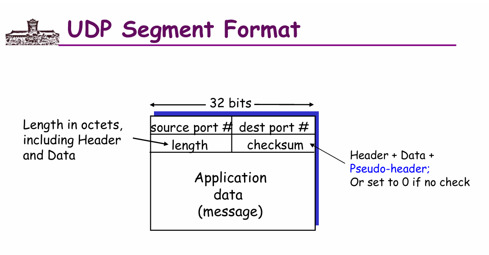
UDP报文段的首部只有8字节，包含4个字段：源端口号、目的端口号、长度和校验和，每个字段占2字节
UDP的首部下面就是数据部分，数据部分的长度由UDP首部中的长度字段指定（首部+数据的总长度，以字节为单位）
比如对于DNS应用来说，DNS查询报文段的UDP首部下面就是DNS查询报文，DNS响应报文段的UDP首部下面就是DNS响应报文

### 检验和
检验和提供了差错检验功能，用于确定UDP报文段从源到目的地移动时其中比特是否发生改变。
发送方的UDP对报文段首部的另外三个16bit进行二进制反码求和，也就是先求和，如果有溢出就回卷，最后对结果取反得到反码作为检验和
在接收方，把所有16bit的首部都求和，得到的结果应该是16个1.如果不是，那么就说明在传输过程中报文段发生了错误

UDP虽然提供这样的差错检测，对差错恢复无能为力。

## 可靠数据传输原理
可靠数据传输为上层实体提供的服务抽象是数据可以通过一条可靠的信道进行传输。借助于可靠信道，传输数据的比特不会受到损坏或丢失。这也正好是TCP为调用它的互联网应用提供的服务模型。
实现这种服务抽象是**可靠数据传输协议**的责任，由于这个协议的下层协议也许是不可靠的，所以这是一个很难的任务。比如TCP在不可靠的IP端到端网络层上实现的可靠数据传输协议
我们可以直接把较低层视为不可靠的点对点信道。
在这节中，我们不断开发一个可靠数据传输协议。我们假设底层信道不会对分组进行重排序。本节讨论的内容不只适用于互联网的运输层，所以我们使用术语“分组”而不是“报文段”，因为分组是一个更一般的术语。
我们仅考虑单向数据传输，也就是数据传输是从发送端到接收端的，反过来没有数据传输。
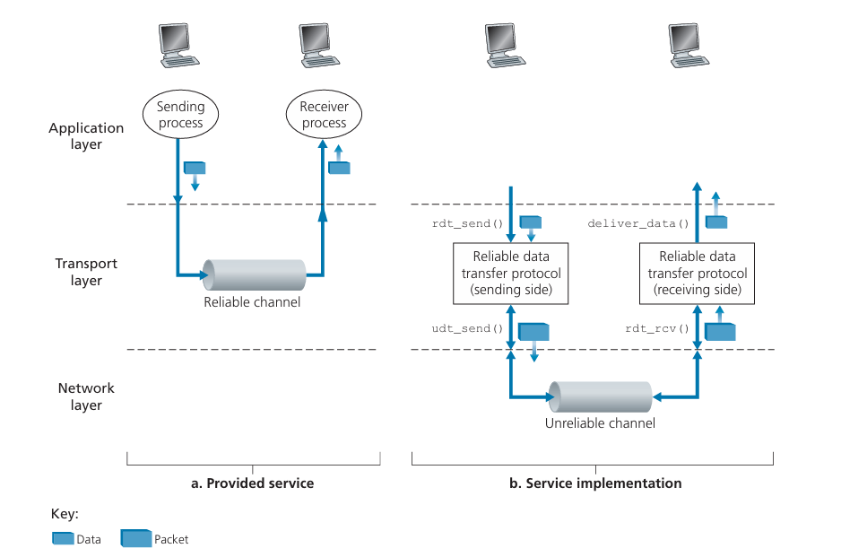
在这个图中，rdt就是可靠数据传输协议，底层信道是不可靠的点对点信道，udt是不可靠数据传输协议
上层通过rdt_send函数(send表示发送端正在被调用)把数据传递给rdt协议，rdt协议把数据封装成分组并且通过底层的udt_send函数把分组传递给不可靠的点对点信道
接收端在rdt_rcv函数中接收分组并进行处理，然后通过deliver_data函数把数据交付给上层

### 构造可靠数据传输协议
现在我们一步步研究一系列协议，最后得到一个完美可靠的数据传输协议
#### 经完全可靠信道的可靠数据传输：rdt1.0
先考虑底层信道是完全可靠的情况，这是最简单的。
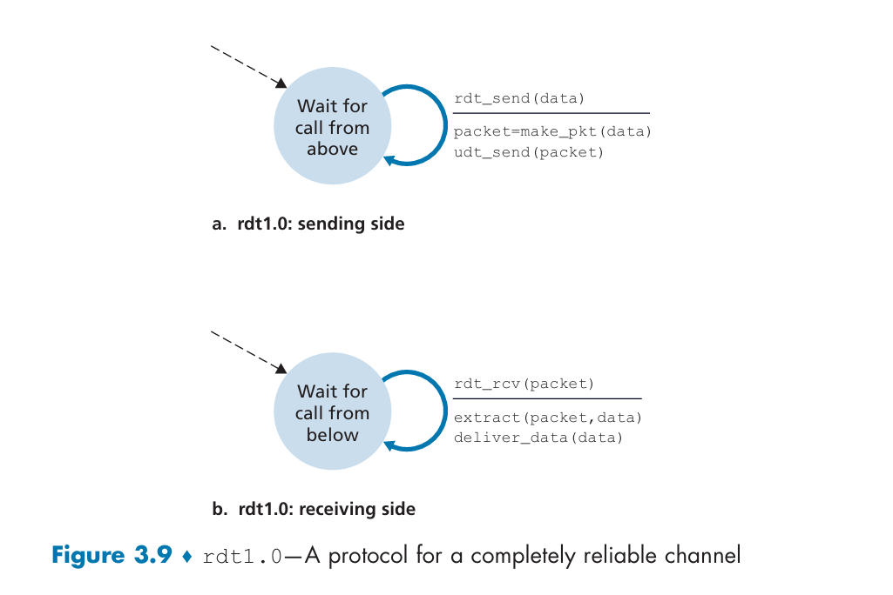
这是rdt1.0的发送方和接收方的有限状态机(Finite State Machine, FSM)
发送方和接收方各有一个自己的FSM，每个都只有一个状态
箭头表示状态转换，引起转换的事件显示在横线上方，采取的相应操作在横线下方
FSM的初始状态用虚线表示

rdt的发送端通过`rdt_send(data)`事件接受更高层的数据，产生一个分组`packet`并且用`udt_send(packet)`发送到信道中
rdt的接收端通过`rdt_rcv(packet)`事件接受来自信道的分组，用`extract(packet, data)`提取数据，并且通过`deliver_data(data)`事件把数据交付给上层

在这个简单的协议里面，一个单元数据和一个packet没差别，所有分组由发送方流向接收方，分组永远不会丢失或损坏，因此接收端不用提供任何反馈信息。

#### 经具有比特差错信道的可靠数据传输：rdt2.0
更为实际的情况是分组中的**比特可能会受损**。
假定所有分组（可能比特受损）还是按照其发送的顺序被接受


在通常情况下，报文接受者在正确接收支行使用**肯定确认**("OK")，在内容接受有误时使用**否定确认**("请重复一遍")，发送者在收到肯定确认之前重传分组。基于这种重传机制的可靠数据传输协议叫做**自动重传请求协议**（Automatic Repeat reQuest, ARQ）
ARQ还需要另外三种协议功能来处理比特差错
- 差错检测。
- 接收方反馈。理论上只需要一个bit，0表示否定确认NAK，1表示肯定确认ACK
- 发送方重传。收到有错误的分组时，发送方重传分组
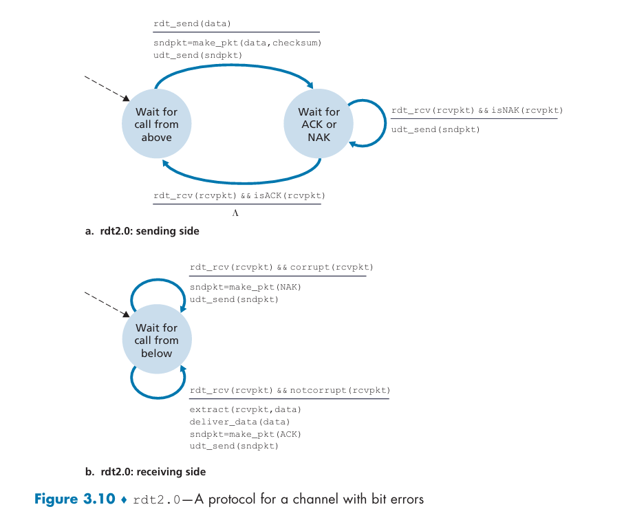
$\Lambda$表示没有事件或者动作
这个状态图描述了rdt2.0的发送方和接收方

在发送端，有2个状态。在左边的状态，发送端等待来自上层的数据。当rdt_send(data)事件发生时，产生一个分组，带有检验和，然后用udt_send(packet)发送到信道中，并且转移到右边的状态。在右边的状态，发送端等待来自接收端的反馈。如果rdt_rcv(rcvpkt)并且isACK(rcvpkt)事件发生，发送端转移回左边的状态。如果rdt_rcv(rcvpkt)并且isNAK(rcvpkt)事件发生，发送端重传分组并且保持在右边的状态

当发送方在等待状态时，不能从上层获得更多数据，也就是说rdt_send(data)不会出现，直到收到ACK离开当前状态
因此发送方在确信接收方已经正确接收分组之前不会发送下一个分组，这就是**停等协议**（Stop-and-Wait Protocol）的名字由来

在接收端依然只有一个状态，要么回答ACK，要么回答NAK

#### rdt2.0的改进
rdt2.0有一个致命的缺陷：如果ACK或NAK分组在传输过程中发生了比特差错，那么发送端就无法区分是ACK还是NAK
对于这种情况，如果我们收到含糊不清的反馈，我们可以选择重传分组
但是会引入**冗余分组**，这样接收方不知道收到的分组是一个新的分组还是一次重传

一个简单的方法是在数据分组中加一个新字段，让发送方对数据分组编号，把**序号**放在该字段。
于是接收方只需要检查序号就可以确定是否是重传的分组。
对于停等协议，1bit的序号就够了，如果接收到的序号和最近收到的分组相同，就知道是重传的分组
ACK和NAK分组不需要指明他们回复的分组序号，发送方知道是为最近发送的分组的回复。因为我们这个信道假设不会丢分组。
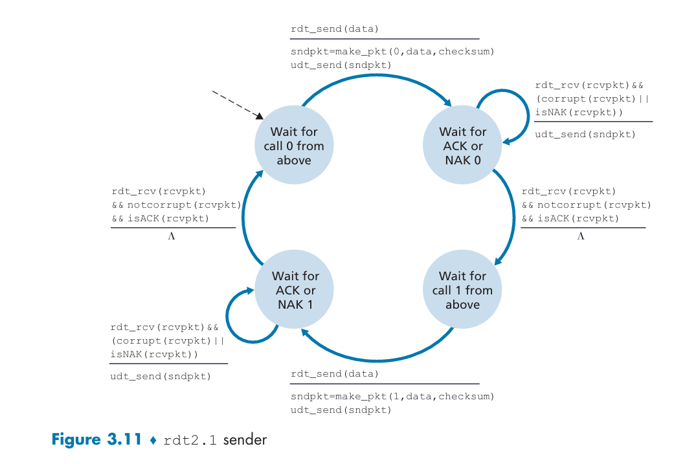
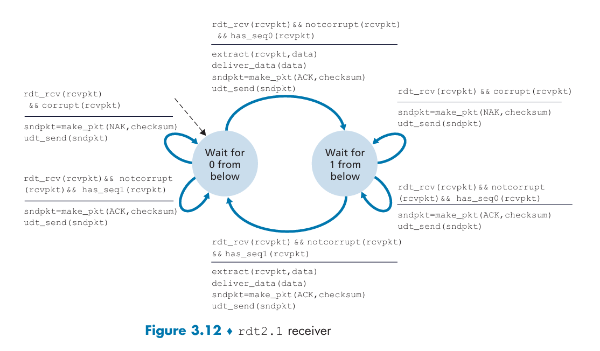
这是rdt2.1的FSM，是2.0的修订版，状态数是以前的2倍。
协议状态必须反映出分组的序号是0还是1.

如果发送端收到冗余的ACK，就知道接收方没有正确接受相同的ACK后面发送的分组，所以发送端重传分组
这样就可以形成一个没有NAK的协议，叫做rdt2.2
2.2与2.1相似，但是2.2里面的ACK必须指明它是为哪个分组的ACK，这样发送端就可以区分冗余ACK和正确ACK了

#### 经具有比特差错和分组丢失的信道的可靠数据传输：rdt3.0
在rdt2.2的基础上，我们还要考虑分组丢失的情况（丢包）
在这里，我们让发送方负责检测和恢复丢包。假定发送方发送的数据分组或者接收方对该分组的ACK丢失，发送方等待足够长的时间来**确认**分组丢失，然后重传分组即可

但是需要等待多久来确认某些东西丢失？
至少需要等待一个往返时延+接收方处理一个分组所需时间
但是很多情况下最坏情况下的最大时延很大，理想的协议应该尽快从丢包中恢复过来，所以实践中是发送方明智的选择一个时间，判断是否发送丢包（尽管不能确保）。
这样会有引入冗余数据分组的可能性，但是在rdt2.2中，我们已经可以通过引入序号来处理冗余数据分组

在发送方看来，重传是万能的。不管是什么分组丢失了，只要重传就可以。
为了实现这个机制，需要一个**倒计时计时器**，在一个给定的时间量过期时，发送方就重传分组
发送方需要：
1. 每次发送一个分组（包括第一次发送和重传）时启动一个计时器
2. 响应计时器中断
3. 终止计时器
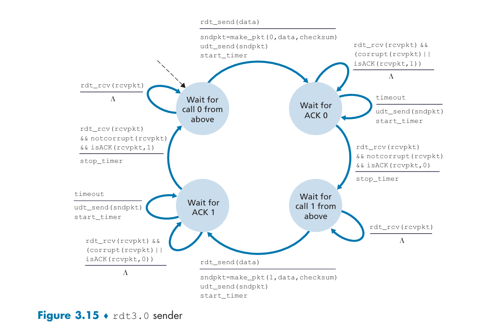
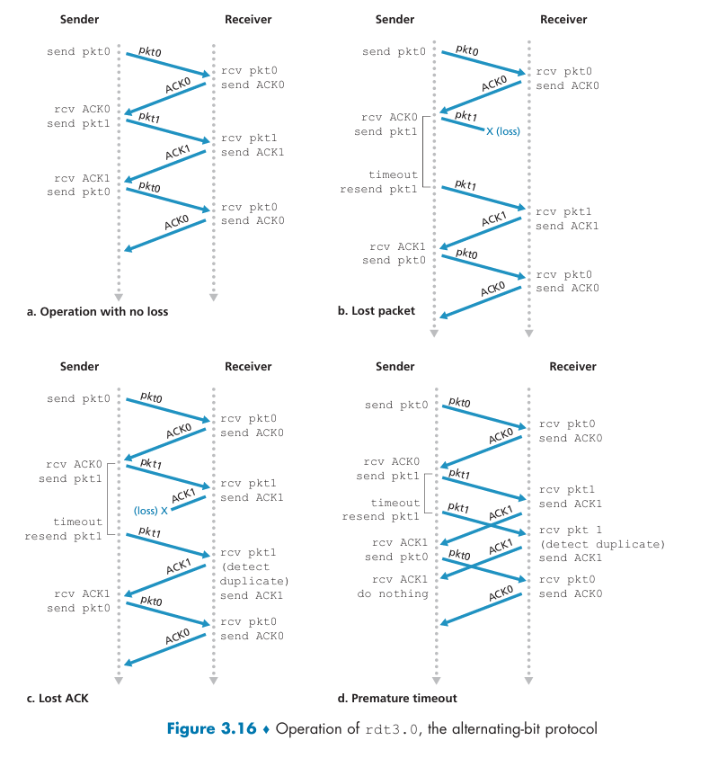
时间从图中的顶部朝底部移动，发送方的方括号部分是定时器的设置时刻以及超时。
因为分组序号在01之间交替，所以rdt3.0也称为**比特交替协议**（Alternating Bit Protocol, ABP）

### 流水线可靠数据传输协议
rdt3.0是一个功能正确的协议，但是由于他是一个停等协议，性能不佳。
让我们看一个例子。现在有两台主机在美国的东西海岸，要进行通信。在这两个端系统之间光速往返传播时延RTT=30ms，通过一个发送速率$R=1Gbps$也就是$R=10^9 bit/s$的链路相连。假设包括首部的数据分组长$L=1000byte=8000 bit$，那么发送一个分组进入链路的时间
$$
t_{trans}=\frac{L}{R}=\frac{8000}{10^9}=8\mu s
$$
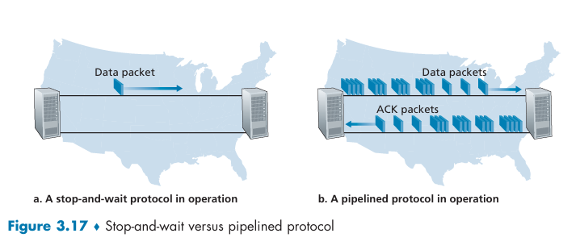
如果发送方从t=0时刻开始发送，那么在t=8μs时分组的最后1bit进入链路了，在t=15.008ms时分组的最后1bit到达目的地了
假设ACK分组很小，也就是忽略他的发送时间，接收方一旦收到最后1bit就立即发送ACK分组，那么在t=15.008ms时ACK分组进入链路了，在t=30。008ms时ACK分组到达发送方了
所以，在30.008ms中，只有0.008ms用于发送方的发送
定义发送方的**信道利用率**为发送方发送数据的时间占总往返时延的比例，那么在这个例子中，信道利用率是
$$
U_{sender} = \frac{t_{trans}}{RTT+t_{trans}} = \frac{8\mu s}{30.008ms} \approx 0.00027
$$
可以看出来，**停等协议的信道利用率非常低**

一个简单的解决方法，就是不以停等方式运行。允许发送方发送多个分组，无需等待确认
这也就是**流水线技术**，有如下要求
- 必须增加序号范围，不能只是0/1，因为每个输送中的分组必须有一个唯一的序号
- 协议的发送方和接收方需要缓存多个分组，比如发送方需要缓存已发送但是还没有确认的分组
- 差错恢复。有两种方法，**回退N步**（Go-Back-N）和**选择重传**（Selective Repeat）
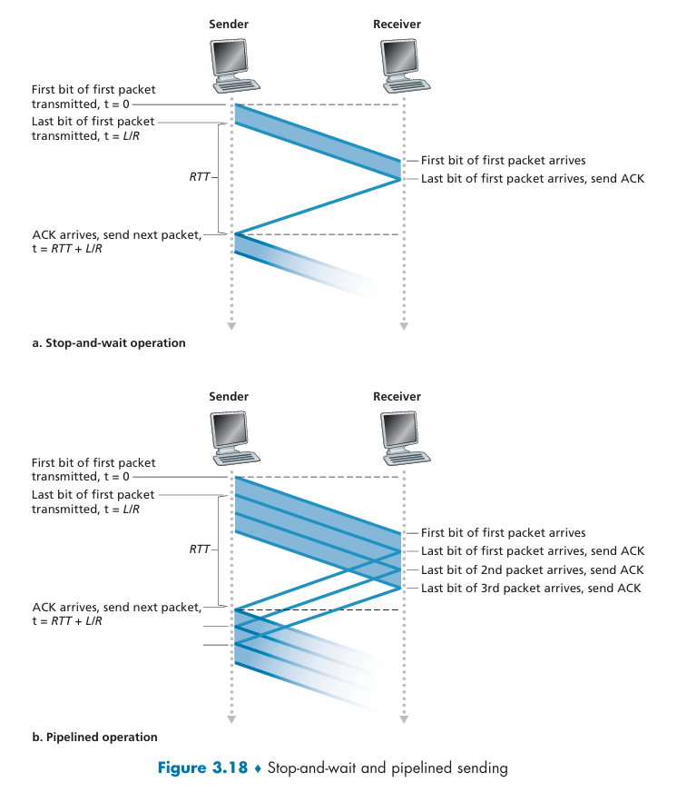

### 回退N步协议(GBN)
允许发送方发送多个分组，不需等待确认
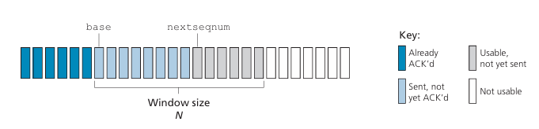
这是GBN协议的序号范围。**基序号**(base)是最早的未确认分组的序号，**下一个序号**(nextseqnum)是下一个要发送的分组的序号。**窗口长度**N是发送方允许发送的最大分组数
GBN也被称为**滑动窗口协议**，因为发送方的窗口在分组被确认时向前滑动

对于GBN的发送方，必须响应：
- 上层的调用rdt_send(data)，先检查窗口是否已满，如果没有满就发送分组并且更新nextseqnum，否则数据返回给上层（或者用同步机制允许上层仅在窗口未满时调用rdt_send(data)）
- 收到一个ACK。对序号为n的分组，采用累积确认，表明接收方已经收到序号为n及之前的所有分组了。
- 超时事件。定时器用于恢复数据或确认分组丢失，如果超时，发送方重传所有已发送但是未确认的分组。

对于GBN的接收方，如果一个序号为n的分组正确接收，并且按序（也就是上一个交付给上层的数据是序号为n-1的分组），接收方就交付数据给上层，并且发送ACK_n。
所有的失序分组，接收方丢弃。接收方**可能**缓存提前到达的分组，但是如果分组n丢失，那么分组n和分组n+1将被重传。
所以不如直接丢弃n+1，这样接收缓存还可以更简单。
发送方需要维护base和nextseqnum两个变量，接收方需要维护一个变量expectedseqnum来记录下一个期望收到的分组的序号
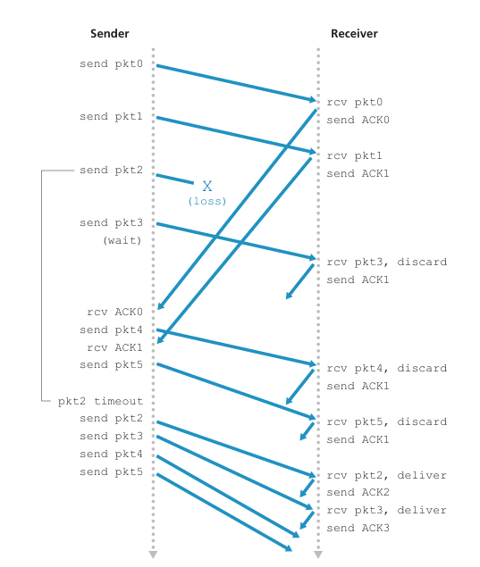
对于这个窗口长度为4个分组的情况，发送方在发送了0-3分组之后必须等待，在接受到连续的ACK之后窗口才能向前滑动

### 选择重传协议(SR)
当窗口长度和带宽时延积很大时，GBN的性能会很差，因为丢失一个分组就要重传所有未确认的分组
SR协议允许发送方仅重传他怀疑在接收方出错（丢失或受损）的分组，而不是重传所有未确认的分组，从而避免不必要的重传
因此需要接收方逐个确认正确接受分组
SR的接收方确认一个正确接受的分组，不需要按顺序，失序的分组被缓存直到所有丢失分组都被收到
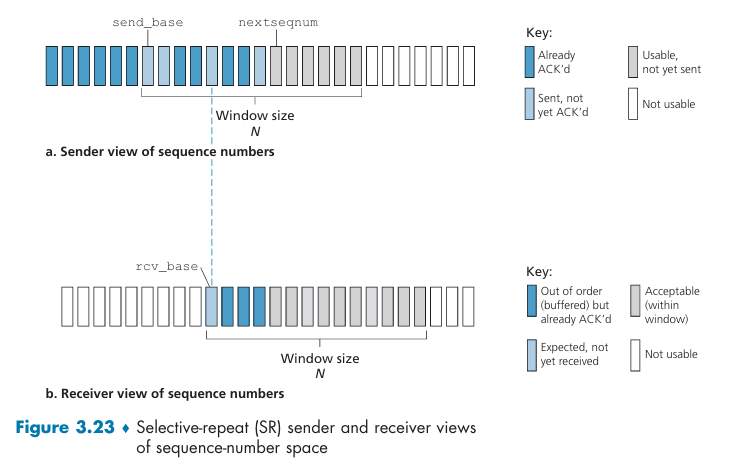
对于发送方：
- 从上层收到数据，检查下一个可用的序号。如果在窗口内，就打包发送，否则缓存数据或者返回上层
- 超时，每个分组必须有自己的定时器，因为超时后只发送一个分组
- 收到ACK，如果分组在窗口内，那么标记为已接收，如果ACK分组的序号是base，那么就把窗口向前滑动到下一个未确认的分组
对于接收方：
- 序号在[base, base+N)内的分组，也就是提前到达的分组，正确接收就缓存并且发送ACK，如果这个序号等于base，那么把一批分组交付给上层，并且把窗口向前滑动到下一个未确认的分组
- 序号在[base-N, base)内的分组，必须发送ACK，也就是别的分组在等他。就算是以前收到过的分组也要ACK
- 其他情况，丢弃分组
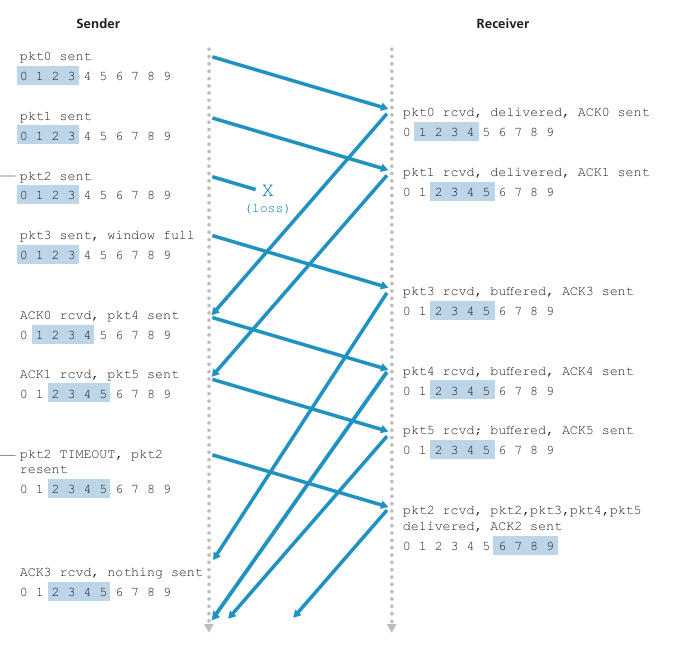
对于接收方的第二条很重要，需要重新确认已经收到过的小于base的分组，否则发送方就无法知道这些分组已经被接收了，可能会一直重传这些分组
也就是说，发送方和接收方的窗口并不总是一致
窗口长度必须小于等于序号空间大小的一半，否则接收方可能分不清是重传还是新分组了

## 面向连接运输：TCP
### TCP连接
TCP是一个**面向连接的**协议，因为在应用程序向另外一个应用程序发送数据之前，必须先互相握手，也就是相互发送预备报文段来确保数据传输的参数。
TCP协议只在端系统中运行，中间的网络元素不会维持TCP连接状态，中间路由器只看到数据报，看不到连接
TCP提供的是**全双工服务**，如果一台主机上的进程A和另外一个主机上的进程B有一条TCP连接，那么应用层数据可以在从B流向A的同时从A流向B
TCP也总是**点对点**的，也就是单个发送方和单个接收方之间的连接

假设现在一个进程需要与另一个主机上的一个进程建立一条TCP连接。发起连接的称为**客户进程**，等待连接的称为**服务器进程**
客户进程通知客户的运输层，`clientSocket.connect(serverName, serverPort)`，其中serverName是服务器的主机名或者IP地址，serverPort标识了服务器上的进程
客户发送一个特殊的TCP报文段，然后服务器用另一个特殊报文段响应，最后客户用第三个特殊报文段响应。前两个本文段不包含应用层数据，第三个报文段可能包含应用层数据。因为发送了3个报文段，所以这个连接建立过程叫做**三次握手**（three-way handshake）

客户进程通过**套接字**传递数据流，经过套接字后数据就由客户中的TCP控制。
TCP把数据引导到该连接的**发送缓存**，接下来TCP时不时地从发送缓存取出一块数据，传递给网络层。可以取出并且放入报文段的数据数量受限于**最大报文段长度**（MSS）
MSS不包括TCP首部和IP首部的长度，MSS的值由本地发送主机发送的最大链路层帧长度（最大传输单元，MTU）来设置

TCP为每块客户数据配上TCP首部，形成多个TCP报文段，TCP把这些报文段传递给网络层，网络层把每个报文段封装成一个IP数据报并且发送到目的地
TCP在另一端接收到报文段后，报文段的数据放入接收缓存中，应用程序从接收缓存中读取数据流
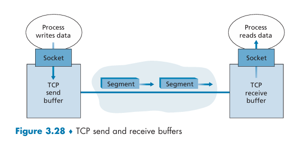

### TCP报文段结构
TCP报文段由首部字段和数据字段组成，数据字段包含一块应用数据。
当TCP发送一个大文件时，通常划分他为长度为MSS的若干块（最后一块除外），每块数据配上一个TCP首部形成一个TCP报文段
TCP首部一般长度为20字节，包含以下字段：
- 源端口号和目的端口号：每个占16bit
- 序号和确认号：每个占32bit
- 接收窗口字段：16bit，用于流量控制
- 首部长度字段：4bit，指明TCP首部的长度，以32bit字为单位，由于TCP的选项字段的存在（一般为空），TCP首部的长度不一定是20字节，所以需要这个字段来指明首部长度
- 检验和字段：16bit，提供差错检测功能
- 标志字段：6bit，包含URG、ACK、PSH、RST、SYN和FIN标志位
    - ACK用于确认字段中的值是有效的
    - RST、SYN和FIN用于连接的建立和拆除
    - PSHbit置位表示接收方应该尽快把数据交付给应用程序
    - URGbit置位表示报文段包含被上层置为紧急的数据
- 紧急数据指针字段：16bit，指出紧急数据的最后一个字节在数据字段中的位置
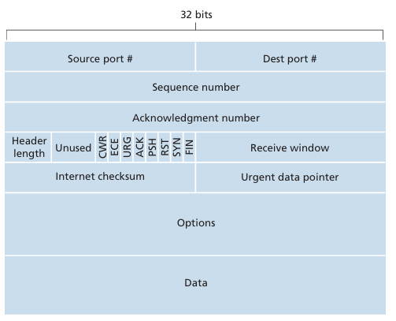

#### 序号和确认号
TCP把数据看成一个无结构的、有序的字节流。TCP的序号建立在字节流之上，而不是传送的报文段的序列之上。
因此一个TCP报文段的序号是该报文段**首字节的字节流编号**
假设主机A上一个进程通过TCP向主机B的一个进程发送数据流，数据流由一个500k字节的文件组成，其MSS为1k字节。
那么TCP把数据流构建成500个TCP报文段，每个报文段的数据字段包含1k字节，给第一个报文段分配序号0，第二个报文段分配序号1000，第三个报文段分配序号2000，以此类推，序号填入TCP首部的序号字段中
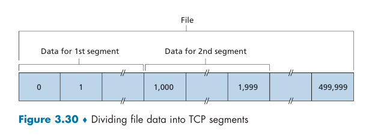

由于是全双工的，A向B发送数据的同时，也许也接收来自B的数据。从B来的报文段中有一个序号用于B流向A的数据。
主机A填进报文段的**确认号**是A期望从B那里收到的下一个字节的序号
假设A已经收到了来自B的序号为0-535的所有字节，同时他打算发送一个报文段给B，所以现在报文段的确认号字段就应该填536
假设A收到了0-535和另一个来自B的900-1000报文段，在等待536-899，那么确认号仍然是536，因为A还没有收到536-899的字节
TCP只确认该流中到第一个丢失字节为止的字节，这就是**累积确认**

实际上，这个例子里面第三个报文段（900-1000字节）是失序的，因为他提前到达了。TCP没有规定如何处理失序的报文段，TCP实现者可以选择丢弃失序的报文段，也可以选择缓存失序的报文段直到所有丢失的字节都被收到（实践中多用后者）

#### 以Telnet协议为例
Telnet是一个基于TCP的应用层协议，允许用户远程登录到主机上
Telnet是一个交互式应用，与批量数据传输的应用不同
现在很多用户使用SSH来远程登录到主机上，因为Telnet连接中发送的数据是没有加密的，容易受到窃听攻击
Telnet很适合用来学习序号和确认号的使用

假设主机A发起一个与主机B的Telnet会话，A是客户，B是服务器
客户端的用户键入的每个字符被发送到远程主机，远程主机回送字符的副本给客户，显示在用户的屏幕上
这样的**回显**确保用户发送的字符已经被远程主机正确接收并且在远程站点上得到处理
所以从用户击键到字符显示在用户屏幕上，每个字符在网络中来回传输两次
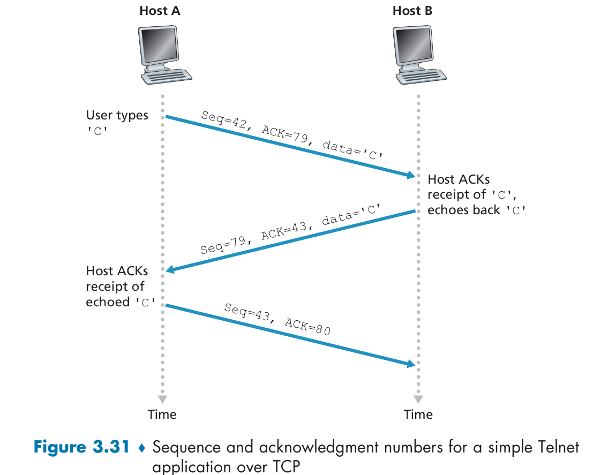
在用户输入一个字符C之后，假设客户和服务器的起始序号是42和79
第一个报文段由客户发往服务器，数据字段包含字符C，序号为42，确认号为79
第二个报文段由服务器发往客户，首先他提供一个收到数据的确认，在确认号里面填上43，然后第二个目的就是回显，所以数据字段包含字符C，序号为79。客户到服务器的数据的确认被装在一个服务器到客户的报文段中，这叫做**捎带**
第三个报文段由客户发往服务器，数据字段为空，序号为43，确认号为80。这个报文段的目的就是确认服务器的回显报文段已经被客户正确接收了

### 往返时间的估计与超时
TCP的超时/重传机制与rdt的一样，但是超时的间隔时间长度如何设置？显然他至少应该大于连接的往返时间RTT，也就是一个报文段发出到他被确认的时间。那么RTT是多少？

#### 估计往返时间
往返时间Round Trip Time, RTT

报文段的样本RTT（SampleRTT）是一个报文段从发送到这个报文段的确认被收到的时间
在某个时刻，TCP只会为**一个**已发送但是目前未确认的报文段计算SampleRTT，产生一个接近RTT的新的SampleRTT值
不会对每次发送的报文段都测量一个SampleRTT，一般而言RTT的差异不会太大，所以算一个RTT就够了，还能节约开销
TCP不为重传的报文段计算SampleRTT，因为他无法判断ACK是为第一次发送的报文段还是为重传的报文段的ACK

由于路由器的拥塞和端系统负载的变化，SampleRTT的值可能会变化，任何SampleRTT可能都是非典型的。TCP需要获得一个典型的RTT值，因此维护一个SampleRTT的加权平均值，叫做EstimatedRTT
每次获得一个新的SampleRTT，就用下面的公式更新EstimatedRTT
$$
EstimatedRTT = (1-\alpha) \cdot EstimatedRTT + \alpha \cdot SampleRTT
$$
其中$\alpha$是一个介于0和1之间的常数，通常取0.125

显然，这个加权平均对最近样本的权重比旧的样本的权重大，这种平均被称为**指数加权移动平均**（Exponential Weighted Moving Average, EWMA）
这里指数指的是权重值在更新过程中呈现指数型的快速衰减
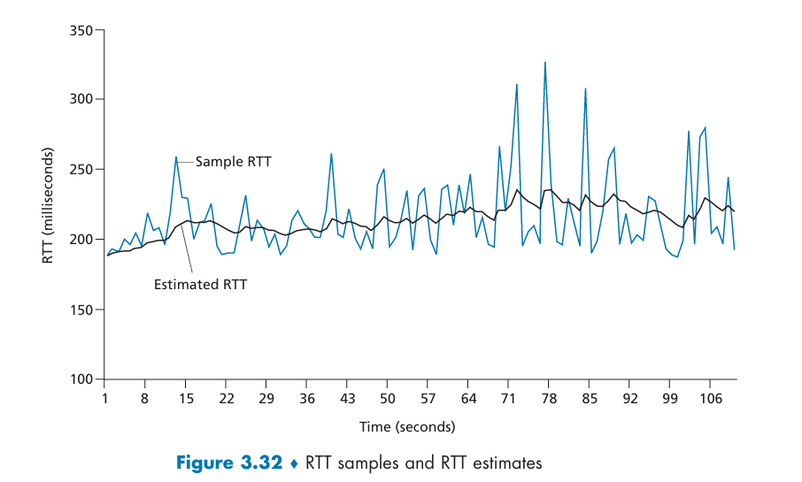
RTT偏差devRTT用于估算SampleRTT偏离EstimatedRTT的程度
$$
devRTT = (1-\beta) \cdot devRTT + \beta \cdot |SampleRTT - EstimatedRTT|
$$
其中$\beta$也是一个介于0和1之间的常数，通常取0.25

#### 设置和管理重传超时间隔
假设现在我们已经有了EstimatedRTT和devRTT，那么TCP超时间隔应该用什么值？
显然应该大于EstimatedRTT，但是也不能大太多，否则重传就太慢了，数据传输时延大
$$
TimeoutInterval = EstimatedRTT + 4 \cdot devRTT
$$
出现超时之后，TimeoutInterval会加倍，避免后面的报文段过早出现超时
当然，一个新的EstimatedRTT的计算会把TimeoutInterval重置为EstimatedRTT+4*devRTT

### 可靠数据传输
网络层的IP服务是不可靠的，他不保证数据报的交付、顺序和数据完整性
TCP在不可靠的IP服务上实现了**可靠数据传输**服务，确保进程在接收缓存中读出的数据是无损坏、无间隙、非冗余和按序的
如果对每一个已发送未确认的报文关联一个定时器，需要很大的开销。因此TCP只用单一的重传计时器

先给出一个TCP发送方的高度简化的描述，假设只用超时机制来恢复报文段的丢失。
下面是对于TCP发送方高度简化描述的一个实现。
对于发送方有3个与发送和重传有关的主要事件：
- 从上层应用程序接收数据
- 定时器超时
- 收到一个ACK
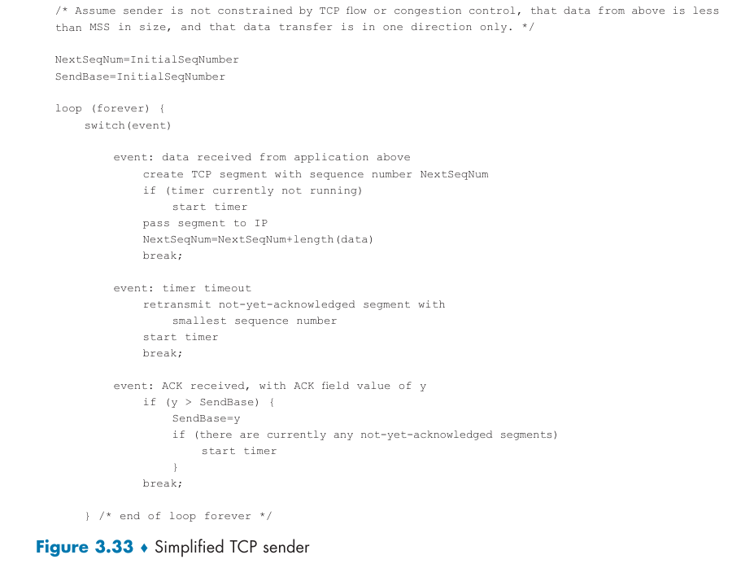

#### 从上层应用程序接收数据
TCP从应用程序接收数据，把数据封装在一个报文段中，然后把报文段交给IP
如果定时器没有运行，那么TCP就启动定时器，定时器的过期间隔是TimeoutInterval

#### 超时
TCP通过重传报文段来响应超时事件
然后重启定时器

#### 收到一个ACK
准确的说，是收到了一个报文段，该报文段的ACK字段值是有效的

这个时候，TCP把ACK的值y（确认号）与他的变量SendBase比较，SendBase是最早的未被确认的字节的序号
由于TCP采取累积确认，所以y已经保证了所有y之前的字节都已经确认收到
如果y>SendBase，那么这个ACK是在确认之前未被确认的报文段，于是更新SendBase=y
只有y大于SendBase时才更新SendBase

#### 一些有趣的情况
