# Lec4: Network Layer: Data Plane
## 网络层概述
网络层分为两个相互作用的部分，数据平面和控制平面。
路由器的数据平面的主要作用是从输入链路向输出链路转发数据报，控制平面就是协调这些转发的机制

### 转发和路由选择
两种重要的网络层功能：
- 转发：将数据报从输入链路转发到输出链路。是在数据平面中实现的唯一功能
- 路由选择：确定数据报从源到目的地的路径。**路由选择算法**，在控制平面中实现

每个路由器有一个关键元素是他的**转发表**
路由器检查到达的数据报的首部的字段的值，使用这些值在转发表中索引，从而实现转发

### 网络服务模型
网络服务模型定义了分组在发送和接收主机之间的端到端传输特性
- 确保交付
- 有序分组交付
- 确保最小带宽
- 安全性
这些是部分网络层能提供的服务列表

因特网的网络层提供了单一的服务：**尽力而为**（best effort）服务

交换和转发这两个术语可以经常互换
值得说明的是**分组交换机**是一台通用分组交换设备，根据分组首部字段的某些值。实现分组的转发
某些分组交换机被称为**链路层交换机**，其他的被称为**路由器**。（因为两者根据的分组类型不同，前者是链路层的帧，后者是网络层的数据报）

## 路由器工作原理
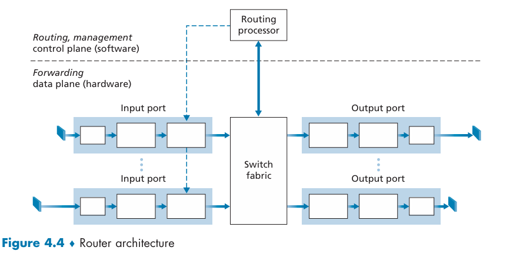
一个路由器有四个组件：
- 输入端口：这里端口的概念和前面的软件端口概念不同，而是物理的输入输出接口。输入端口有三个小方框，后续会详细介绍
- 交换结构：连接输入端口和输出端口的内部网络。他是一个网络路由器里面的网络
- 输出端口
- 路由选择处理器：执行控制平面的功能
路由器的输入端口、输出端口和交换结构总是由硬件实现。数据平面的执行时间在纳秒尺度，而控制平面的执行时间在毫秒尺度，所以控制平面一般用软件实现

### 输入端口处理和基于目的地转发
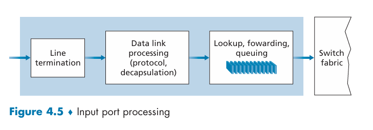
这是一个更为具体的输入端口的结构图。
输入端口的第一个小方框是线路端接，实现了各个输入链路的物理层和链路层。
在输入端口里面实现的**查找**是至关重要的，路由器通过转发表来查找输出端口
转发表是由路由选择处理器计算和更新的，由独立总线复制到线路卡

下面我们看基于目的地转发，一个最简单的情况
假如我们现在有0-3 4个链路接口，对于32bit的IP地址，总共有超过40亿个，不能对每一个目的地址都存一个表项，不然太多

用目的地址的前缀来匹配
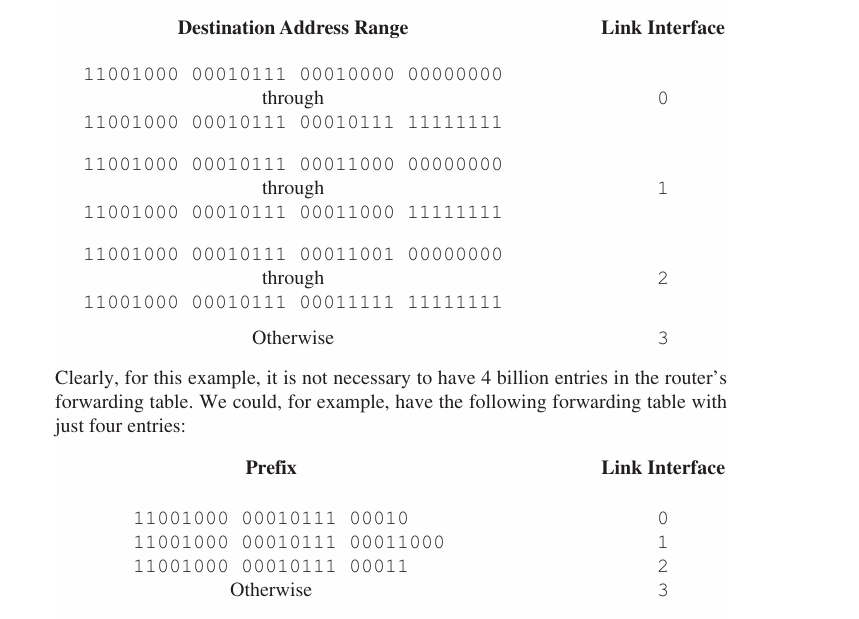
但是，我们可以看到链路接口1和2的前24位是一样的，我们怎么知道匹配哪一个表项？
所以是**最长前缀匹配**规则，寻找最长的匹配项（也就是匹配的位数最多的表项）

假设我们现在已经有了转发表，查找这个表听起来很简单，但是在Gb的速率之下，这种查找必须在纳秒级别完成，所以不仅必须用**硬件**支持，还需要快速查找算法。同时内存访问时间也不能忽略，所以用**TCAM**（Ternary Content Addressable Memory）来实现转发表，TCAM可以在一个时钟周期内完成查找

确定了输出端口之后，分组就能够进入交换结构。如果有其他输入端口的分组正在使用交换结构，那么就会被阻塞，导致排队

### 交换
交换结构是一个路由器的核心部位。有三种常见的交换技术
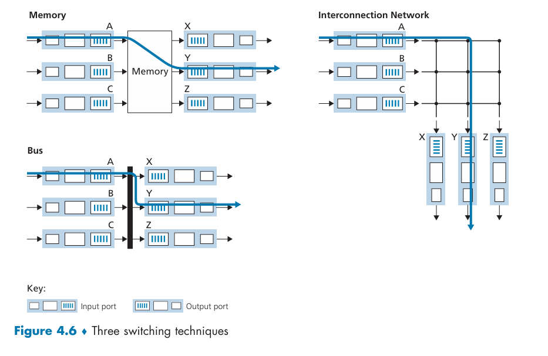
- 经内存交换。
  - 这种交换结构是最简单的，交换在CPU直接控制下完成
  - 像传统的I/O设备，分组到达时发起中断信号，然后复制分组到内存中，CPU读取分组首部，查找转发表，确定输出端口，然后将分组复制到输出端口
  - 缺点是CPU的速度远远低于链路速率，CPU的处理能力成为瓶颈，而且不能同时转发2个分组
- 经总线交换。
  - 经过一根共享总线传送到输出端口
  - 输入端口分配一个内部标签（首部），指示输出端口，所有输出端口都能收到但是只有标签匹配的能保存。随后标签被去掉
  - 如果有多个分组同时抵达路由器，还是必须等待，因为一次只能有一个分组跨越总线
- 经互联网络交换

### 输出端口处理
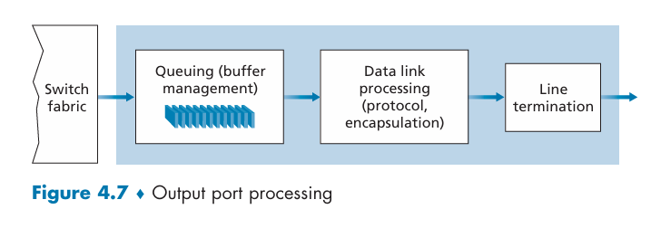

### 何处需要排队？
随着队列的增长，路由器的缓存空间最终将会耗尽，从而出现**丢包**
假设输入线路与输出线路速率相同，都是$R_{line}$个分组每秒，并且有N个输入端口和输出端口
假设分组有相同的固定长度，同步的方式到达输入端口
定义交换结构的传送速率$R_{switch}$

#### 输入排队
如果交换结构不能同时处理**所有**输入端口的分组，那么就会出现输入排队
我们按照FCFS方式处理分组，假设所有链路速度相同
只要输出端口不同，不同的分组可以并行传输，但是如果相同，就必须排队，在输入队列中等待，因为交换结构一次只能传送一个分组到输出端口
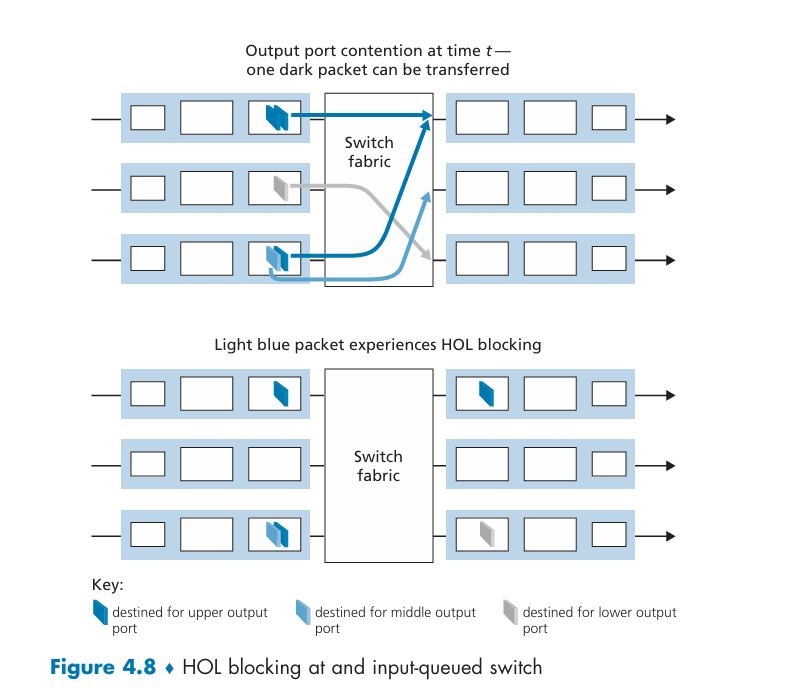
在这个图中，输入端口1和3都要发往输出端口1，交换结构决定先处理输入端口1的分组，输入端口3的分组就必须排队等待
在输入端口3中，这个深色的分组后面还有一个要发往输出端口2的浅色分组，尽管他的目的端口空闲，由于排队，他也要等待。
这种现象叫做**头阻塞**（队列首部阻塞，head-of-line blocking, HOL blocking），是输入排队的一个重要问题

#### 输出排队
假定$R_{switch} = N * R_{line}$，并且到达N个输入端口的分组都是发往同一个输出端口，那么就会出现输出排队
因为输出端口的传输时间$R{line}$比交换结构的传输时间$R_{switch}$慢，所以每次到达N个分组的时候，输出端口只能处理一个分组，其他的分组就必须排队等待
久而久之，输出端口的可用内存就被耗尽。这时候要么丢掉新到达的分组（**弃尾**），要么删除已排队的分组腾出空间
可以使用运输层提到的明确拥塞通知（ECN）来标记分组，在缓存填满之前就丢弃一个分组或者加上标记，从而可以向发送方提供一个拥塞信号
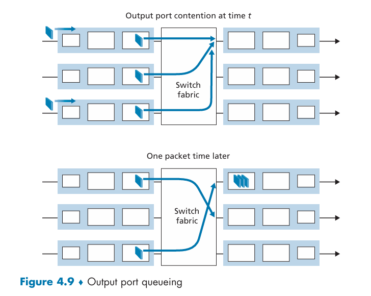
假设现在N是3，那么传输一个分组的时间以后，3个分组同时抵达端口1，从而排队。输出端口的**分组调度器**选择一个分组进行传输，后续将会讨论。

#### 多少缓存才够用？
分组到达速率超过转发速率的时候，就会出现排队，端口的缓存慢慢变满，最终导致丢包
那么到底要预分配多少缓存？
之前常用的经验方法是缓存数量B应该等于RTT和链路容量C的乘积
更新的理论提出，$B=\frac{RTT * C}{\sqrt{N}}$，其中N是同时使用链路的TCP连接数

更多的缓存当然很好，因为可以减少丢包率，提高网络性能
但是也有可能导致潜在的更长的排队时延

### 分组调度
排队的分组按照什么样的顺序经过链路传输？

#### 先进先出
FIFO(FCFS)，最简单的分组调度算法，按照分组到达的顺序进行调度
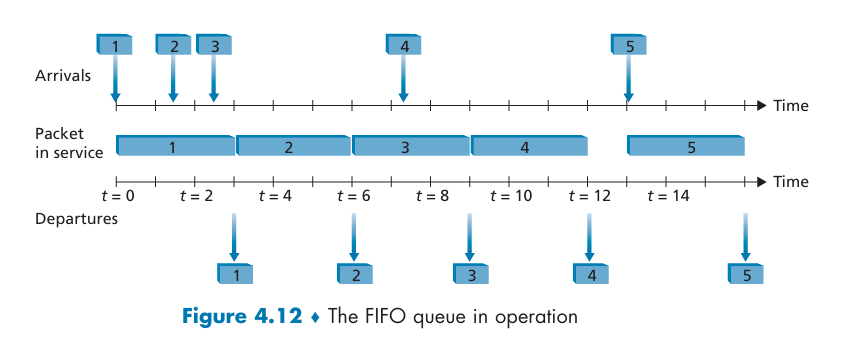

#### 优先权排队
priority queuing，分组被分为不同的优先级队列，优先级高的队列先传输
到达的分组被分类放入优先权类中
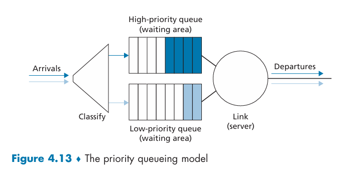
同一优先权队列的分组按照FIFO方式调度
在**非抢占式**的优先权排队中，正在传输的分组不会被更高优先级的分组打断

#### 循环和加权公平排队
循环排队规则(round-robin scheduling)
分组也会被分类，但是没有严格的服务优先权，循环调度器在这些类之间轮流提供服务
在**保持工作排队**规则中，规则在有分组排队等待时，不允许链路空闲。如果查找一个类的分组没有找到，就立刻检查循环序列中的下一个类
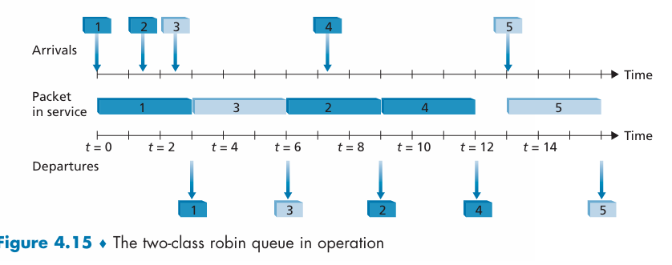
比如这里分了两类，1,2,4是第一类，3,5是第二类，调度器先从第一类中选择一个分组传输，然后从第二类中选择一个分组传输，循环往复

**加权公平排队**(Weighted Fair Queuing, WFQ)是循环排队的一个扩展，允许不同的类有不同的权重
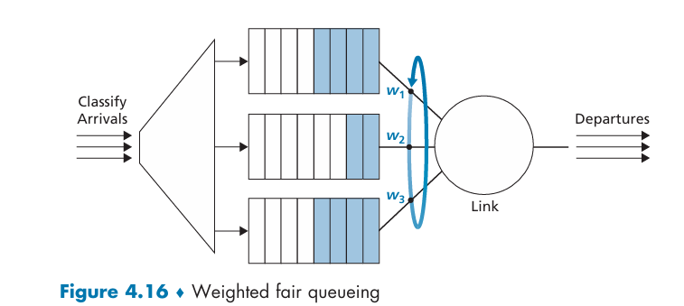
WFQ和循环排队的不同在于，每个类在任何一个时间间隔里面可能收到不同数量的服务，取决于它的权重
每个类$i$被赋予权重$w_i$，在任何一个时间间隔内，类$i$至少会得到$\frac{w_i}{\sum_j w_j}$的服务
分母的和是所有**有分组排队**的类的权重之和
所以对于一个传输速率为R的链路，哪怕所有的类都有分组排队，类$i$在任何一个时间间隔内至少会得到$\frac{w_i}{\sum_j w_j} * R$的服务(吞吐量)

## IPv4，寻址和IPv6
### IPv4数据报格式

网络层的协议是IP协议，IP协议的第4版就是IPv4
网络层的分组被称为**数据报**
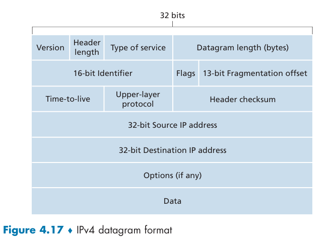
关键字段包括：
- 版本号：4bit，IPv4是4，IPv6是6
- 首部长度：4bit，单位是32bit的字，最小值是5。因为选项字段的存在，首部长度可能大于5，当然大部分情况下是5
- 服务类型：8bit，定义了数据报的优先级和服务类型，可以区分不同类型的数据报(Type of Service, ToS)
- 数据报长度：16bit，单位是字节，指整个数据报的长度，包括首部和数据部分
- 标识、标志和片偏移：这些字段用于分片和重组
- TTL：8bit，生存时间(Time To Live)，每经过一个路由器就减1，直到0时被丢弃
- 协议：8bit，在到达最终目的地的时候才有用，指明数据报的上层协议，比如TCP是6，UDP是17，就像端口号是连接运输层和应用层一样，协议字段连接了网络层和运输层
- 首部校验和：16bit，整个首部的校验和
  - 校验和的计算：首部的每2个字节看成一个数，用反码运算对这些数求和，得到的结果再取反码就是校验和
  - 路由器对每个收到的数据报计算检验和，如果携带的检验和和算出来的不一样，那么出现差错，一般会丢弃
  - 由于TTL和选项字段可能会改变，路由器必须重新计算校验和并且更新数据报的首部
- 源和目的IP地址：32bit，源IP地址是发送方的IP地址，目的IP地址是接收方的IP地址
- 选项：32bit的字，选项字段是可选的，主要用于网络管理和调试
- 数据（有效载荷）：数据报的有效载荷，通常是运输层的分组，比如TCP报文段或者UDP报文段

### IPv4编址
一台主机通常只有一条链路连接到网络，主机中的IP想要发送一个数据报时候，就在这个链路上发送
主机和物理链路之间的边界叫**接口**，现在我们考虑一台路由器以及他的接口。
因为路由器必须接收数据报并且转发，所以路由器必须有两个或者更多的链路，路由器和他的任何一条链路之间的边界也叫一个**接口**，因此他有多个接口
IP要求每个主机和路由器接口有自己的地址，所以IP地址实际上与一个接口相关联，而不是与主机或者路由器相关联

IP地址的结构
IP地址是一个32bit的二进制数，通常用**点分十进制**表示，比如193.32.216.9
就是把他的二进制用4个8bit的块分开，每个块转换成十进制数，然后用点分隔开来
每台主机和路由器的接口必须有全球唯一的一个IP地址，当然不是自由选择的，一部分需要由他连接的子网来决定
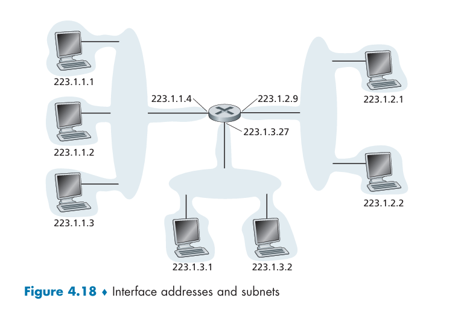
这个图里面路由器有3个接口，连了7个主机，可以看到左边三个主机的前24位是相同的，都是223.1.1，这可能是通过以太网互联的。
我们把互联这3个主机接口和1个路由器接口的网络叫做**子网**，子网的地址是223.1.1.0/24，这个/24(slash 24)称为**子网掩码**，表示32bit的最左侧的24位定义了子网地址。
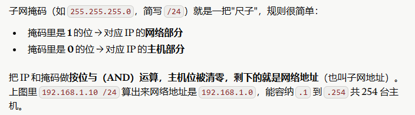
以后所有要连接进这个子网的主机都要求他的地址有223.1.1这个形式
如何判断是不是子网？
把所有的路由器和主机的连接断开，会形成隔离的网络岛，有几个岛就有几个子网
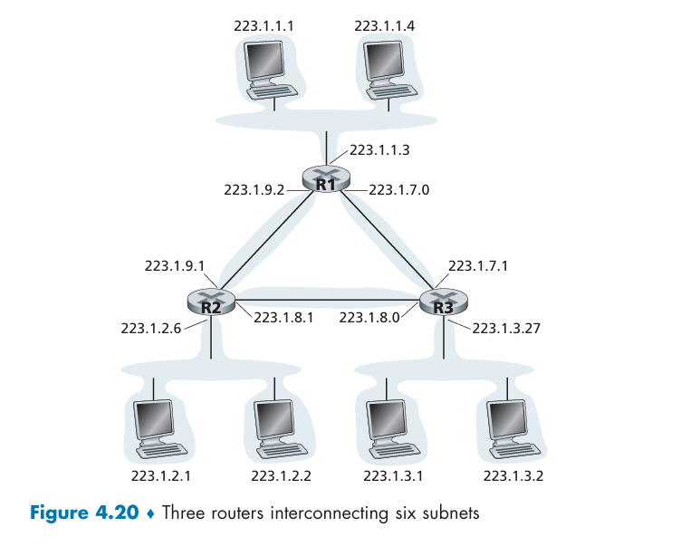
这里就有6个子网，路由器和路由器的端口连接也算子网

因特网的地址分配策略是**无类别域间路由选择**，CIDR
使用子网寻址时，32bit的IP地址被分为两部分，前面是**网络号**，后面是**主机号**
a.b.c.d/x，x是网络号的长度，前x位是网络号，后32-x位是主机号
网络号也常被称为**前缀**，主机号也常被称为**后缀**
一个组织被分配一块空间，因而一般具有相同的前缀，因此后缀是用来区分组织内部设备的
组织内部的路由器转发分组时，才会考虑后缀的比特

CIDR采用之前，IP的网络号分为8bit，16bit，24bit的三类地址，分别称为A类，B类和C类
这是**分类编址**
1个c类网络的子网只能有254个主机(两个地址有特殊用途，.0和.255)，这可能太小了，而一个B类子网又可支持的太多了

地址.255是IP广播地址255.255.255.255，主机发送到这个地址的数据报会被同一个网络中的所有主机接收

#### 获取一块地址
为了获取一个IP地址用于组织的子网内，管理员先与他的ISP联系，ISP会从已分配给他的更大的地址块中提供一些地址
比如ISP已被分配200.23.16.0/20的时候，他可以把这一块地址分成8个连续地址块，分给最多8个组织，这8个组织都是/23的前缀
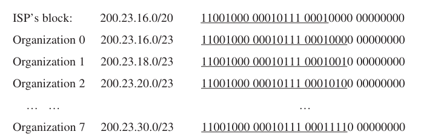

当然，从ISP获取地址不是唯一的方法，显然我们需要给ISP本身来获取一个地址
IP地址由因特网名字和数字地址分配机构(IANA)来分配，IANA将地址分配给区域互联网注册机构(RIR)，RIR再分配给ISP，ISP再分配给组织

#### 获取主机地址：动态主机配置协议(DHCP)
一个组织获得了一块地址，就可以为本组织内的主机和路由器接口分配IP地址
DHCP允许主机自动获取（被分配）一个IP地址，管理员可以配置DHCP使得某个给定的主机每次与网络连接的时候得到一个**相同的IP地址**或是得到一个**临时的IP地址**。
DHCP也被称为**即插即用协议**或**零配置协议**，因为能够自动配置主机的IP地址，主机不需要管理员手动执行就可以加入网络

DHCP是一个客户-服务器协议，客户是新到达的主机，客户要求获得包括自身的IP地址在内的许多网络配置信息
在最简单的条件下，每个子网都有一个DHCP服务器，或者一个提供中继代理服务的路由器，这个代理指导DHCP服务器的地址
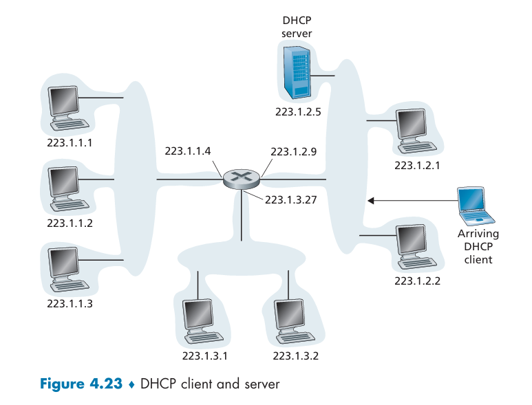
这个图里的服务器为223.1.2/24提供DHCP服务，路由器为223.1.1/24和223.1.3/24提供DHCP中继服务

对于一个新到达的主机，我们假设他的DHCP服务器是在子网上的，不需要经过路由器中继，那么需要经过四个步骤
- 1. DHCP服务器发现。通过**DHCP发现报文**完成，客户在UDP分组中向端口67发送发现报文，然后封装好的IP数据报通过**广播目的地址**255.255.255.255到所有与该子网连接的节点
- 2. DHCP服务器提供。服务器收到一个DHCP发现报文的时候，发送一个**DHCP提供报文**，里面包含了一个IP地址和其他配置信息，仍然使用广播
- 3. DHCP请求。客户收到一个或多个提供报文后，选择一个IP地址，然后发送一个**DHCP请求报文**，通知所有的DHCP服务器他选择了哪个IP地址
- 4. DHCPACK。服务器收到请求报文后，发送一个**DHCP确认报文**，通知客户他可以使用这个IP地址了

收到DHCP ACK之后，交互完成，客户可以在**IP地址租用期**内使用该IP地址

### 网络地址转换(NAT)
家庭网络中常用
一个NAT使能的路由器有一个接口，是家庭网络的一部分，家庭网络的四个接口有相同的网络地址10.0.0.0/24
地址空间10.0.0.0/8是**专用地址空间**，不能在因特网上使用
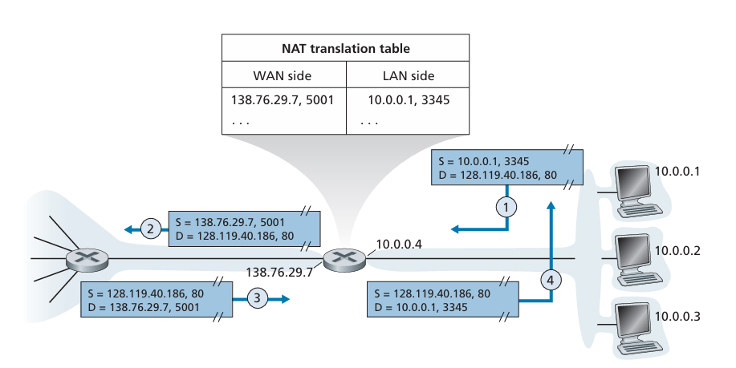
对于外部世界来说，NAT不像一个路由器，而是一个有单一IP地址的单一设备
就像在图中一样，所有离开家庭路由器的报文都有相同的一个源IP地址138.76.2.9.7，且所有进入家庭的报文有相同的目的IP地址

路由器中有一张**NAT转换表**，包含了端口号和IP地址
以这个图里的交互为例，家庭中的一个主机10.0.0.1，请求IP地址为128.119.40.186的Web服务器(端口80)的一个Web页面，主机指派了源端口号3345并且把这个数据报发到LAN(局域网)中
NAT路由器收到该数据报之后，给该数据报一个新的端口5001，把源IP替换成NAT路由器广域网一侧的IP，把源端口换成5001，然后把这个数据报发到广域网中
生成一个新的源端口号时，NAT可以选择任何一个当前不在NAT转换表中的源端口号
当NAT路由器收到来自Web服务器的响应数据报时，他的目的端口是5001，所以从NAT转换表里面检索到5001对应的IP地址是10.0.0.1和端口号3345

### IPv6
32bit的IP地址即将用尽，于是有新的IP协议IPv6

#### IPv6数据报格式
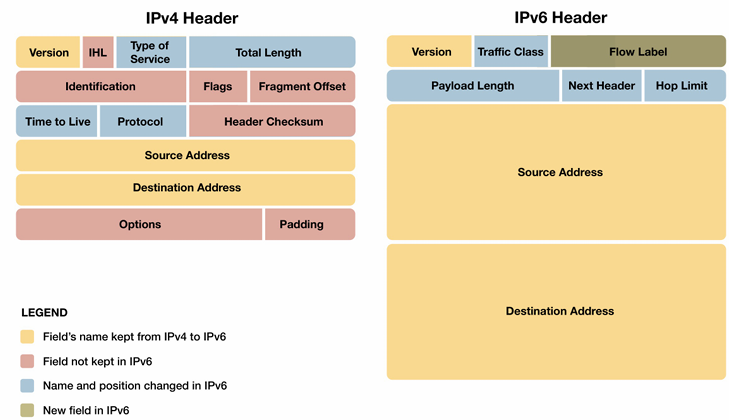
- 版本号：4bit，IPv6是6
- 流量类：8bit，类似IPv4的服务类型字段
- 流标签：20bit，类似IPv4的标识字段
- 有效载荷长度：16bit，类似IPv4的数据报长度字段，给出在IPv6定长的40字节首部之后的有效载荷长度
- 下一个首部：8bit，类似IPv4的协议字段，表示数据报的要交给哪一个协议
- 跳限制：8bit，类似IPv4的TTL字段，转发数据报的每一个路由器对该字段-1，到0被丢弃
- 源和目的地址：**128bit**
- 数据
IPv6的首部是**固定长度的40字节**，所以处理会更快

#### IPv4到IPv6的迁移
IPv6的系统可以兼容IPv4的数据报，但是IPv4的系统不能兼容IPv6的数据报，怎么办
可以选择一个标志日，把所有的机器都关机，然后升级到IPv6，但是这种方法不现实，因为涉及的机器太多

实际方法：**建隧道**
假定两个IPv6节点，要使用IPv6数据报进行交互，但是他们通过IPv4路由器互联，我们把两台IPv6节点之间的IPv4路由器的集合叫做一个**隧道**
在隧道发送端的IPv6节点，可以把IPv6数据报放到一个IPv4数据报的有效载荷部分，于是发往隧道的接收端的IPv6节点
隧道中的路由器不知道这个IPv6数据报的存在，只是把IPv4数据报转发到隧道的另一端
到了接收端，IPv6节点确定这个数据报含有一个IPv6数据报，提取出来，再为这个IPv6数据报提供路由

## 泛化转发和SDN
基于目的地的转发有两个特征：查找目的IP地址（匹配）和把分组发送到输出端口（操作）
在泛化转发中，**匹配加操作表**推广了基于目的地转发表的概念，远程控制器负责计算和更新这个表
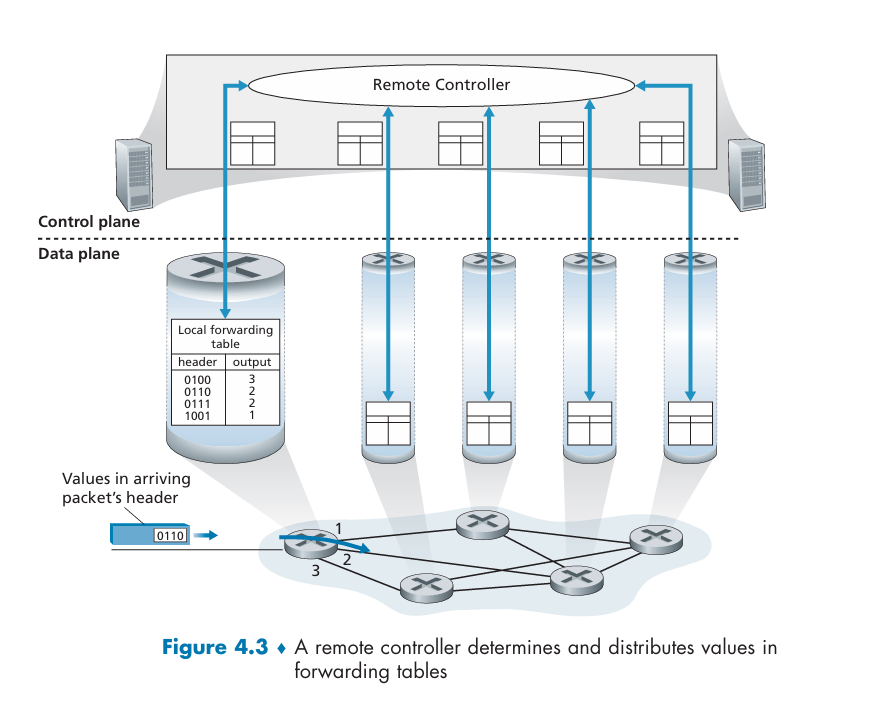
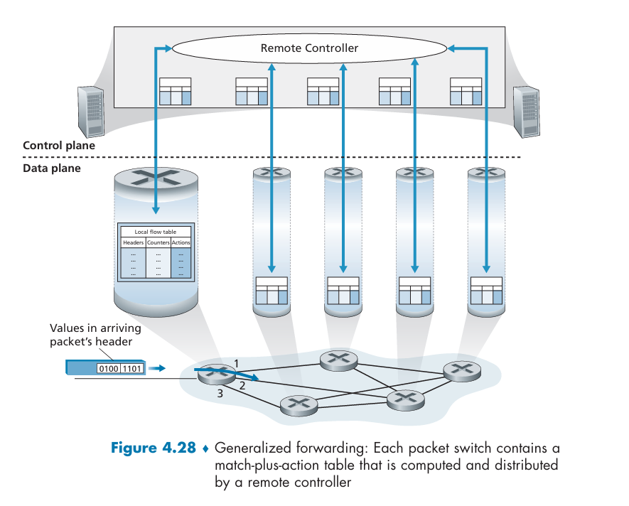
我们将基于OpenFlow讨论泛化转发
匹配加操作表在OpenFlow中被称为**流表**，其每个表项包括
- 首部字段的集合：到达的分组将其首部与该字段集合进行匹配
- 计数器集合：当流表项和分组匹配的时候，更新计数器
- 操作集合：当流表项和分组匹配的时候，执行操作集合中的操作

泛化转发是对于分组交换机而言的（第四层设备），路由器是第三层（网络层）的设备，交换机是第二层的设备（运输层）

### 匹配
OpenFlow1.0规范有12个匹配字段，就是链路层、网络层、运输层的首部字段
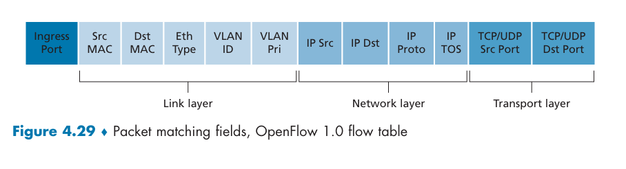
流表项可以有通配符*，比如$128.119.*.*$，表示匹配128.119开头的所有IP地址

### 操作
操作可以包括
- 转发
- 丢弃
- 修改分组首部字段

## 中间盒
中间盒大概可以提供三种服务
- NAT转换
- 安全服务（防火墙，可以用泛化转发实现）
- 性能增强
