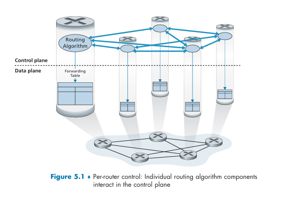
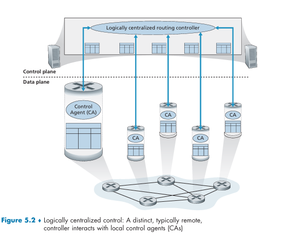
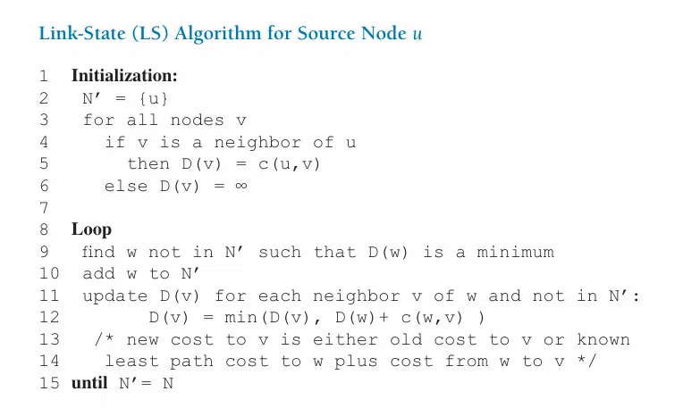

# Lec5: Network Layer: Control Plane
## 概述
转发表（基于目的地转发）和流表（泛化转发）链接了网络层的数据平面和控制平面。
控制平面负责计算转发表或流表，而数据平面则使用这些表来转发。
完成转发有两种工作方式：
- 每路由器控制：**每个路由器**中运行一种路由选择算法
- 逻辑集中式控制：用**逻辑集中式控制器**来计算和分发转发表给每个路由器使用

这种控制器与每个路由器中的一个控制代理（CA）交互，从而配置和管理该路由器的转发表

## 路由选择算法
路由选择算法的目的是从发送方到接收方中找到一条通过路由器网络的好的路径（最低开销）
用图来表示，节点是路由器，边是路由器之间的链路，边的权重是开销。
$G=(V, E)$
对一条边$(x, y)$，用$c(x, y)$表示开销，$c(x, y) = \infty$表示E中没有边$(x, y)$。
路由选择算法可以分为两类
- 集中式路由选择算法：有完整的、全局性的网络信息（连通性和开销），计算出从源到目的地的最低开销路径。通常被称为**链路状态算法**(Link State, LS)
- 分散式路由选择算法：路由器用迭代的方式来计算最低开销路径，每个节点只有与他直接相连的链路的网络信息。一个例子是**距离向量算法**(Distance Vector, DV)

还有一种分类是分为静态路由选择算法和动态路由选择算法，静态的路由算法随时间改变缓慢，通常是人工调整；动态的易于对网络变化做出反应，但是也更容易受影响
还有一种分类是分为负载敏感和负载迟钝算法，关注链路的开销是否会动态的反映出现在的拥塞水平

### 链路状态路由选择算法
在LS算法中，网络拓扑（也就是网络的结构形状）和链路开销都是已知的，可以用作LS算法的输入
实践中，每个节点向网络中所有的其他节点**广播**链路状态分组，每个链路状态分组包含他的连接链路的标识和开销（链路状态广播算法）
于是，所有节点有网络的全局视图，每个节点都能运行LS算法来计算从源节点到所有其他节点的最短路径

LS算法常用的是Dijkstra算法

D存的是从源节点到其他节点的最短路径开销，初始化为正无穷或者是与源u的边的开销
N'是已经计算出最短路径的节点集合，初始时N'只包含源节点s
每次loop就选不在N'中的D值最小的节点w加入N'，然后更新D值
所以要获得最短路径，按照N'中节点的顺序回溯就可以了
复杂度是$O(n^2)$，n是节点数

对于拥塞敏感的路由选择，会发生震荡
假如有2个节点同时在发，由于链路的开销和其承载的流量相关，路由的选择会导致链路的开销发生变化，从而导致路由的选择发生变化，最终可能导致网络中出现循环的情况，也就是震荡
一种解决方案是让并非所有路由器同时运行LS算法，让算法的执行时间不同

### 距离向量路由选择算法
DV是迭代的、异步的、分布式的算法，每个节点从一个或者多个直接邻居收集信息，进行计算，然后将结果发送给邻居
