# Lec5: Network Layer: Control Plane
## 概述
转发表（基于目的地转发）和流表（泛化转发）链接了网络层的数据平面和控制平面。
控制平面负责计算转发表或流表，而数据平面则使用这些表来转发。
完成转发有两种工作方式：
- 每路由器控制：**每个路由器**中运行一种路由选择算法
- 逻辑集中式控制：用**逻辑集中式控制器**来计算和分发转发表给每个路由器使用

这种控制器与每个路由器中的一个控制代理（CA）交互，从而配置和管理该路由器的转发表

## 路由选择算法
路由选择算法的目的是从发送方到接收方中找到一条通过路由器网络的好的路径（最低开销）
用图来表示，节点是路由器，边是路由器之间的链路，边的权重是开销。
$G=(V, E)$
对一条边$(x, y)$，用$c(x, y)$表示开销，$c(x, y) = \infty$表示E中没有边$(x, y)$。
路由选择算法可以分为两类
- 集中式路由选择算法：有完整的、全局性的网络信息（连通性和开销），计算出从源到目的地的最低开销路径。通常被称为**链路状态算法**(Link State, LS)
- 分散式路由选择算法：路由器用迭代的方式来计算最低开销路径，每个节点只有与他直接相连的链路的网络信息。一个例子是**距离向量算法**(Distance Vector, DV)

还有一种分类是分为静态路由选择算法和动态路由选择算法，静态的路由算法随时间改变缓慢，通常是人工调整；动态的易于对网络变化做出反应，但是也更容易受影响
还有一种分类是分为负载敏感和负载迟钝算法，关注链路的开销是否会动态的反映出现在的拥塞水平

### 链路状态路由选择算法
在LS算法中，网络拓扑（也就是网络的结构形状）和链路开销都是已知的，可以用作LS算法的输入
实践中，每个节点向网络中所有的其他节点**广播**链路状态分组，每个链路状态分组包含他的连接链路的标识和开销（链路状态广播算法）
于是，所有节点有网络的全局视图，每个节点都能运行LS算法来计算从源节点到所有其他节点的最短路径

LS算法常用的是Dijkstra算法

D存的是从源节点到其他节点的最短路径开销，初始化为正无穷或者是与源u的边的开销
N'是已经计算出最短路径的节点集合，初始时N'只包含源节点s
每次loop就选不在N'中的D值最小的节点w加入N'，然后更新D值
所以要获得最短路径，按照N'中节点的顺序回溯就可以了
复杂度是$O(n^2)$，n是节点数

对于拥塞敏感的路由选择，会发生震荡
假如有2个节点同时在发，由于链路的开销和其承载的流量相关，路由的选择会导致链路的开销发生变化，从而导致路由的选择发生变化，最终可能导致网络中出现循环的情况，也就是震荡
一种解决方案是让并非所有路由器同时运行LS算法，让算法的执行时间不同

### 距离向量路由选择算法
DV是迭代的、异步的、分布式的算法，每个节点从一个或者多个直接邻居收集信息，进行计算，然后将结果发送给邻居
该算法是自我终止的，一直持续到邻居之间没有更多的信息交换的时候就停止了
Bellman-Ford方程是DV算法的核心
$$
d_x(y) = \min_{v} \{ c(x, v) + d_v(y) \}
$$
v是x的邻居，表示对他的所有邻居求这个值然后取最小
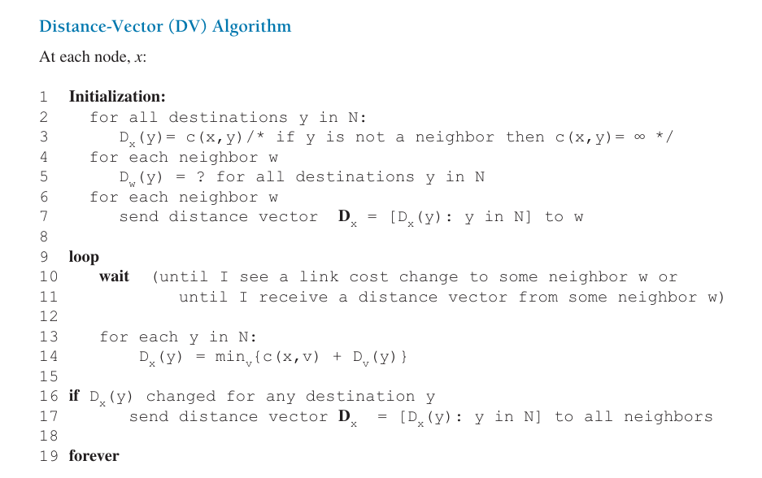
在DV算法中，先初始化，$D_x(y) = c(x, y)$ 是估计值，最终的最短路径开销是$d_x(y)$，D会向d收敛
$D_x$是距离向量，他包含的值是从x到网络中所有节点y的估计开销
每个节点x运行DV算法，要维护的信息：c(x, v)是x到每个邻居v的链路开销，$D_v$是从邻居v收到的距离向量，还有自己的距离向量$D_x$
如果自己的距离向量$D_x$发生了变化，就把新的距离向量发送给所有邻居
如果收到邻居v的距离向量$D_v$发生了变化（或者开销改变），就重新计算自己的距离向量$D_x$
用Bellman-Ford方程来计算$D_x(y)$，然后就可以组成新的距离向量$D_x$

我们让$v*(y)$表示从x到y的最短路径中x选择的邻居节点v，那么x需要知道哪一个是v*，并且更新转发表，向v*转发就可以了
我们来看一个DV算法的例子
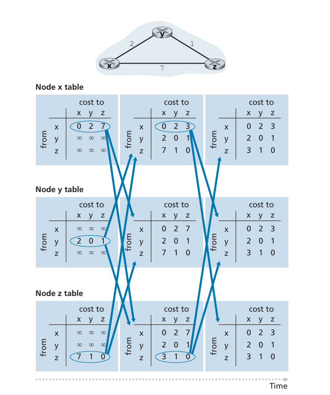
这里有三个路由器，最左侧一列是他们三个路由器初始的**路由选择表**
路由选择表每一行是一个距离向量，初始情况下，每个节点只有自己的距离向量，其他节点的距离向量是正无穷，等待别的节点来更新
初始化之后，每个节点向邻居发送距离向量，然后每个节点计算更新自己的距离向量
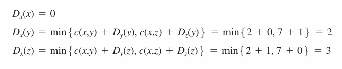
如果有更新，比如图中x的Dx发生了变化，就把新的距离向量发送给邻居，邻居收到之后也会更新自己的距离向量

#### 链路开销改变和链路故障
发现链路开销改变之后，节点重新更新距离向量，如果距离向量有变化，就通知邻居节点
但是由于别的节点的距离向量可能还没有更新，所以可能会导致出现**路由选择环路**（为了到达x，y选择z，z选择y），当然，由于距离向量更新了，邻居会收到新的距离向量然后更新，这样不断循环，最终会收敛到正确的距离向量，但是在收敛之前可能会出现环路
并且，这样链路开销增加的坏消息传播的很慢，也就是说要经过很多次迭代才能得到一个正确的距离向量
而且有可能会出现无穷计数问题

#### 增加毒性逆转
可以通过**毒性逆转**来避免
基本思想就是如果z选择了一条到x的路径是z->y->x，那么z就会告诉y说z到x的距离是无穷大

虽然z到x的距离并不是无穷大，但是告诉y是无穷大，这样y就不会选择z作为下一跳，从而避免了环路

但是毒性逆转不能解决三个或更多节点直接相连的环路问题

环路问题是指包在网络中循环转发的问题，而无穷计数是指距离向量的值不断增加，这个不断更新距离向量的过程可能没有上限，最终达到无穷大
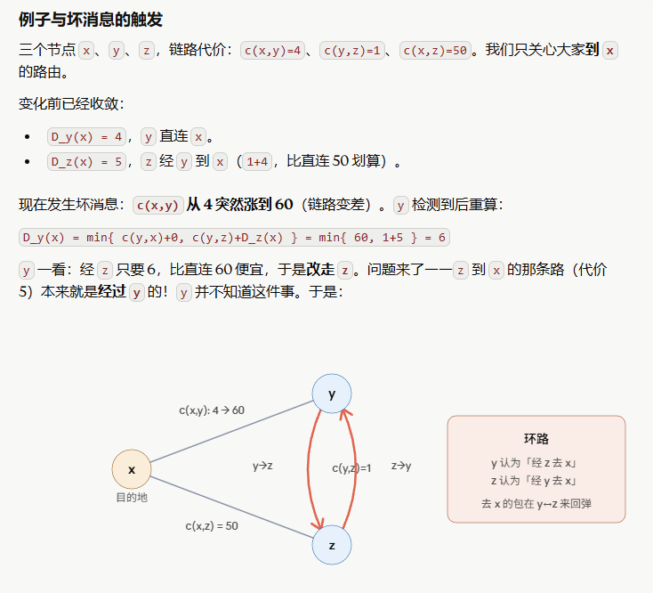
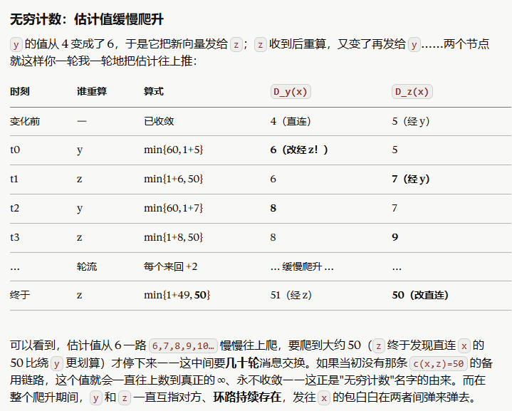

#### LS与DV的比较
- 报文复杂性：LS要求知道每个链路的开销，需要O(nE)的报文复杂性，开销改变时要向所有节点发送新的开销；DV只需要知道邻居的距离向量，在每次迭代的时候在邻居之间交换报文
- 收敛速度：DV的收敛速度慢，并且有可能遇到环路和无穷计数问题；LS的收敛速度快
- 健壮性：LS算法的每个节点是相对独立的，健壮性更强

## 自治系统内部的路由选择：OSPF
- 规模：在如今路由器数目如此巨大的网络中，存储所有的路由选择信息显然需要巨大开销，而广播迭代的距离向量也需要巨大开销，DV算法也难以收敛。
- 管理自治：同时，因特网是ISP的网络，每个ISP有自己的路由器网络，ISP希望对自己的网络进行管理和控制，而不希望其他ISP的路由器影响到自己的网络。
这两个问题可以通过**自治系统**（Autonomous System, AS）来解决，AS是一个路由器网络的集合，由一个组织管理，使用相同的路由选择策略
通常，在一个ISP中的路由器和互联他们的链路组成一个AS，一个AS由全局唯一的AS编号(ASN)来标识

OSPF 就是LS（链路状态）算法在现实网络中的标准实现
OSPF是Open Shortest Path First，是**AS内部**的路由选择协议，OSPF的目标是计算出从源到目的地的最短路径，并且在网络拓扑发生变化时快速收敛
OSPF路由选择是AS内部广泛应用的路由选择协议，是一种链路状态协议，他使用洪泛链路状态信息和Dijkstra算法
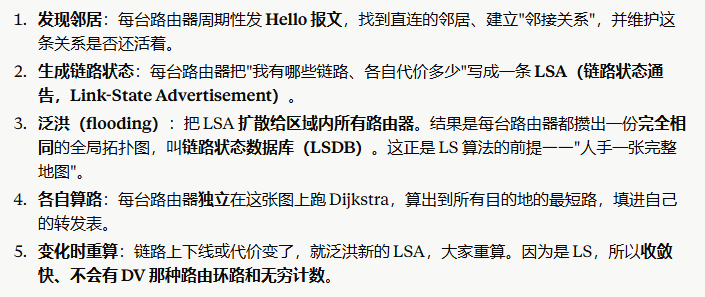
OSPF的通告包含在OSPF报文中，报文由IP承载

## ISP间的路由选择：BGP
### BGP的作用
当分组需要跨越多个AS进行路由时，就需要一个AS间的路由选择协议(inter-AS)，BGP就是这样的协议
因特网中，所有AS运行相同的inter-AS路由选择协议，就是边界网关协议（Border Gateway Protocol, BGP）

对于一个AS和其中的一个路由器，如果一个分组的目的地在这个AS中，那么这个路由器就可以使用AS内部的路由选择协议来转发分组(OSPF)，但是如果分组的目的地不在这个AS中，就需要BGP
BGP把分组路由到一个CIDR化的前缀，而不是一个特定的目的地址。比如138.16.68/22，这个例子包括了1024个IP地址
所以，一个路由器的转发表会有(x,I)的表项，x是前缀，I是路由器的接口号

BGP为每个路由器提供完成下面两个任务的手段
- 从邻居AS获得前缀的可达性信息：允许每个子网向因特网的剩余部分通告他存在，子网因此不是隔离的孤岛
- 确定到该前缀的最好的路由：路由选择

### 通告BGP路由信息
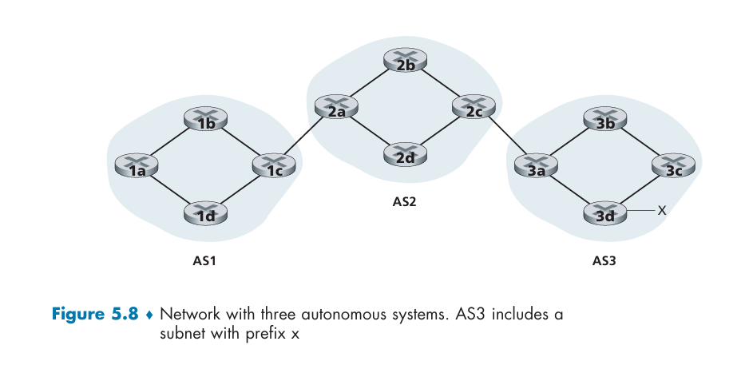
这是有三个AS的例子。AS3有一个有前缀x的子网，所有路由器要么是一个网关路由器，要么是一个内部路由器。网关路由器连接到其他AS的网关路由器，内部路由器只连接到同一个AS中的其他路由器
现在我们要完成一个任务：向图中所有路由器通告前缀x的可达性信息
从高层次的角度来看，首先AS3向AS2发生一个BGP报文，表示x存在并且位于AS3中，这个报文是"AS3 x"
然后AS2向AS1发生一个BGP报文，表示x存在并且位于AS3中，能够先通过AS2然后进入AS3从而达到x，这个报文是"AS2 AS3 x"

实际上，不是AS在发送报文，而是路由器。路由器通过179端口的TCP连接来发送BGP报文，这称为BGP连接
BGP连接分成外部BGP连接（eBGP）和内部BGP连接（iBGP），eBGP连接是两个不同AS的网关路由器之间的连接，iBGP连接是同一个AS中两个路由器之间的连接
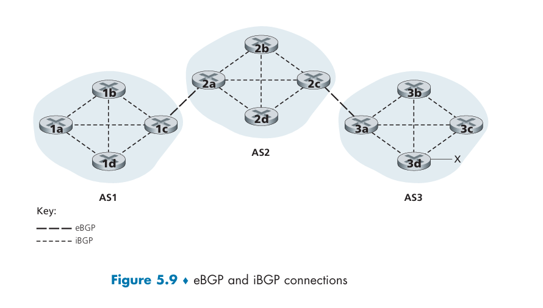
传达x的可达性信息的时候，3a向2c发送一个eBGP报文"AS3 x"，2c向AS2中的所有其他路由器发送报文"AS3 x"
随后，2a向1c发送一个eBGP报文"AS2 AS3 x"，然后1c向AS1中的所有其他路由器发送报文"AS2 AS3 x"

### 确定最好的路由
路由器通过BGP连接来通告前缀时，前缀中会包括一些BGP**属性**，前缀及其属性称为**路由**
两个较为重要的属性是AS-PATH和NEXT-HOP
- AS-PATH：是一个AS的序列，是通告已经通过的AS的列表
- NEXT-HOP：AS-PATH起始的路由器的接口的IP地址
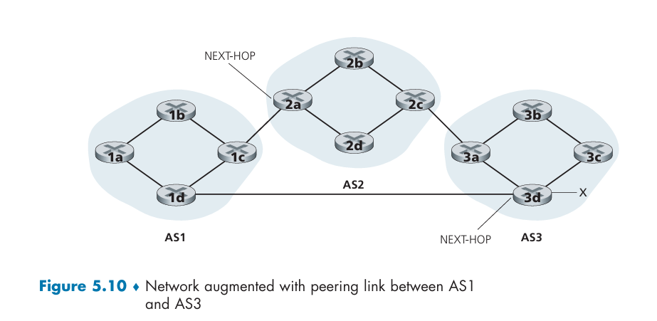
这里有两个AS-PATH："AS2 AS3"和"AS3"
图中所示的就是NEXT-HOP的接口，他不属于AS1，连接到AS1
所以每个BCP路由现在有三个部分：NEXT-HOP，AS-PATH和目的地前缀
AS1中的路由器就知道了两个到前缀x的BGP路由
- NEXT-HOP=2a左侧接口的IP地址, AS-PATH=AS2 AS3, 前缀=x
- NEXT-HOP=3d左侧接口的IP地址, AS-PATH=AS3, 前缀=x

#### 热土豆路由选择
热土豆是最简单的BGP路由选择算法
图中的1b学习到了两条到达前缀x的BGP路由，分别是"AS2 AS3 x"和"AS3 x"
使用热土豆选择，从所有可能的路由中选择的路由是从当前路由器到NEXT-HOP，AS 内部代价最小的路由
在这个例子里面，1b查找AS内部路由信息，找到通往2a的最低开销的AS内部路径和通往3d的最低开销的AS内部路径，选择开销最小的路由
假如选择的是2a，并且通往2a的最低开销路径的接口是I，那么1b就会在转发表中添加一条表项(x, I)

在转发表里面添加AS外部的前缀的时候，显然BGP和OSPF都要用到

热土豆的思想就是他尽快送出分组（开销低），不管AS外部到目的地的开销，就像热土豆一样，赶快丢给别的AS去考虑

#### 路由器选择算法
对于当前路由器已学习并接受的到达某一个前缀的所有BGP路由，路由器选择算法依据下述消除规则直到剩下最后一条路由：
1. 路由被指派一个**本地偏好**属性，具有更高本地偏好值的路由将被选择
2. 在余下的本地偏好值相同的路由中，选择AS-PATH长度最短的路由
3. 在余下的路由中，使用热土豆路由选择算法
4. 如果还有多个路由，用BGP标识来选择
对于前面提到的两种经过/不经过AS2的路由，依靠热土豆我们选择经过AS2，但是由于bypass掉AS2有更短的AS-PATH，所以BGP选择了bypass掉AS2的路由
这样，BGP路由选择算法不再是一个自私的算法，很可能减少端到端时延

## SDN控制平面
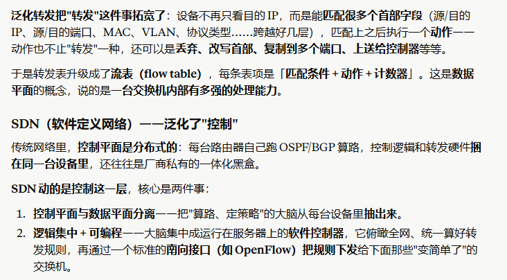
SDN控制器负责计算和分发流表。
SDN体系结构的特征：
- 基于流的转发：转发规则在流表中，SDN控制平面负责计算、管理所有网络交换机中的流表项
- 数据平面和控制平面分离：数据平面由网络交换机组成，在他们的流表中执行“匹配加操作”，控制平面由SDN控制器组成，负责计算和分发流表
- 网络控制功能：在数据平面的交换机外部，SDN控制平面由软件实现，软件在服务器上执行。
- 可编程的网络：网络控制应用程序
数据平面的交换机、SDN控制器和网络控制应用程序是分离的实体
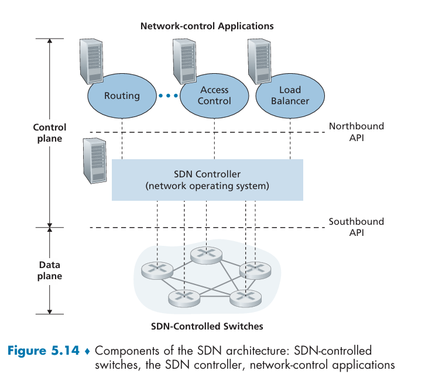

### SDN控制器和SDN网络控制应用程序
SDN控制器的功能可以分为3个层次：
- 通信层：SDN控制器和受控的网络设备之间通信。控制器和受控设备之间通过**南向接口**通信，他们使用OpenFlow这一通信协议
- 网络范围状态管理层：SDN控制器具有相关网络的状态信息
- 对于网络控制应用程序层的接口：**北向接口**与网络控制应用程序通信
SDN控制器逻辑上是集中的，在外部可以被视为单一的整体式服务
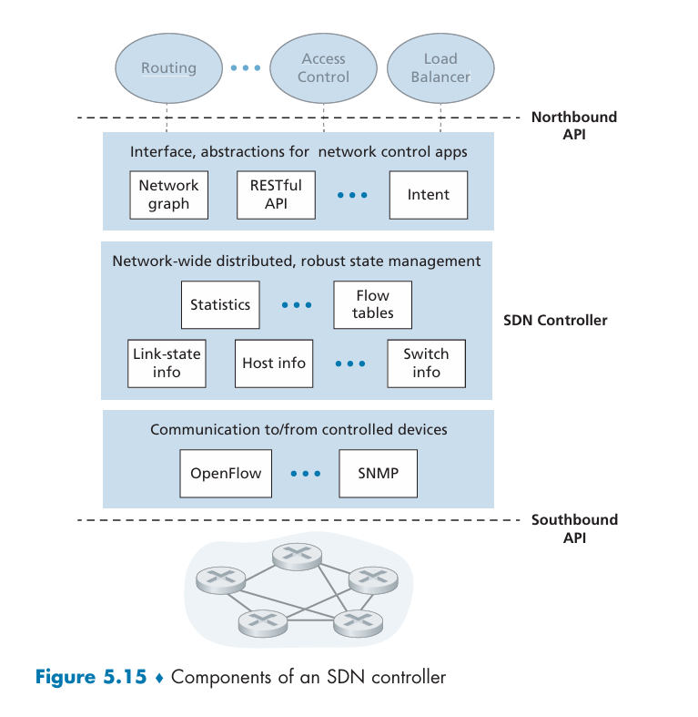

SDN网络控制应用程序就是运行在SDN控制器上的软件模块，比如链路状态路由选择应用程序就可以运用Dijkstra算法来计算流表项，然后通过北向接口交给控制器，再通过OpenFlow协议把流表项下发给受控的交换机

### OpenFlow协议
运行在SDN控制器和他控制的交换机之间的通信协议
运行在TCP之上，端口号是6653
几个常见的从控制器流向受控设备的报文：
- 配置：允许控制器查询并且设置交换机的配置参数
- 修改状态：增删改交换机的流表的表项
- 读状态：从受控设备收集统计数据

从受控设备流向控制器的报文：
- 流删除：通知控制器我已经删除了一个流表项，比如因为超时
- 端口状态：通知控制器端口的状态发生了变化
- 分组入：通知控制器一个分组到达了交换机，但是没有匹配的流表项，要把这个分组交给控制器处理

## ICMP：因特网控制报文协议
因特网控制报文协议ICMP被主机和路由器用来彼此沟通网络层的信息
ICMP最典型的用途是**差错报告**
ICMP通常被认为是IP的一部分，但是在体系结构上他位于IP之上，因为IP分组承载了ICMP报文
因此当一台主机收到一个指明上层协议是ICMP的IP数据报的时候，他就把数据报的内容分解出来交给ICMP来处理，就像交给TCP或者UDP一样

ICMP报文有一个类型字段和一个编码字段，然后包含了引起该ICMP报文首次生成的IP数据报的首部和前八个字节，从而发送方能够确定引起差错的数据报
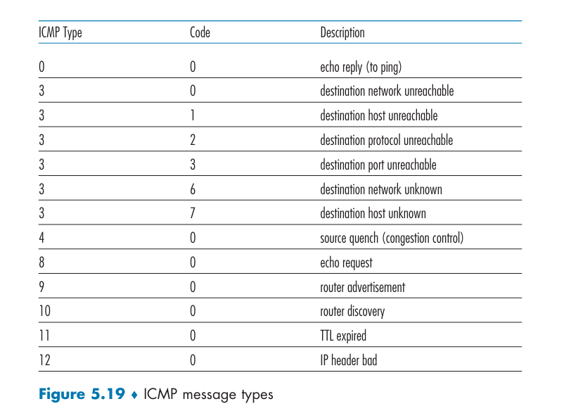
ping程序就是发送一个ICMP类型为8编码为0的回显报文，指定主机收到回显报文之后就会发送一个ICMP类型为0编码为0的回显应答报文