# Lec6: Link Layer and Local Area Networks
## 概述
运行链路层协议的任何设备都称为**节点**，比如主机、路由器、交换机
沿着通信路径连接相邻节点的通信信道称为**链路**
为了把一个数据报从源主机传输到目的主机，数据报必须经过传输路径上的各段链路
在通过链路的时候，传输节点把数据报封装在**链路层帧**中，帧在链路中传输。

### 链路层提供的服务
- 成帧：把网络层数据报封装成帧
- 链路接入：介质访问控制协议(MAC)规定了帧在链路上的传输规则
- 可靠交付：有些链路层协议提供可靠交付，通过确认和重传
- 差错检测和纠正

### 链路层在何处实现
网络适配器（芯片）上实现，链路层控制器的大部分功能都是在硬件上实现的
有部分功能在CPU中由软件实现
链路层是软件和硬件的结合体

## 差错检测和纠正技术
可以使用差错检测和纠正比特(Error Detection and Correction, EDC)来增强数据D
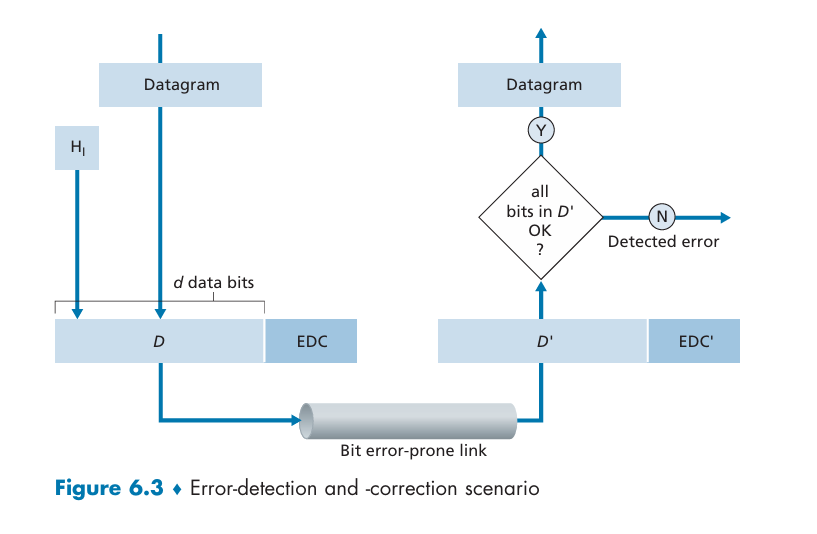
即使采用了EDC，还是有可能**未检出比特差错**
我们研究三种检测差错的技术

### 奇偶校验
最简单的方式，就是加一个奇偶校验位
假设数据D一共有d个bit，那么加的这一个bit要使得总共d+1个bit中1的数量是偶数（偶校验方案）或奇数（奇校验方案）
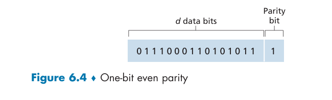
这是一个偶校验方案的例子

假如我们采用偶校验，如果接收方发现了只有奇数个1，那么说明出现了**奇数个**bit差错

对单比特奇偶校验方案进行二维一般化，D的d个bit被划分成了i行j列，对每行和每列计算奇偶值，形成行校验和列校验
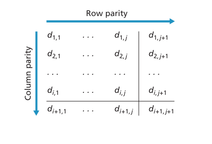
这种二维奇偶校验不仅可以检测出单bit差错，还可以通过行和列来定位，从而可以纠正
两个bit差错，也可以检测出来，但是不能纠正

接收方检测并纠正差错的能力被称为前向纠错，可以减少发送方重传的次数，避免了不得不等待的往返时延

### 检验和
检验和常用于运输层，是把dbit的数据作为一个kbit整数的序列处理

**因特网检验和**把数据作为16bit的整数，进行反码求和，这个和的反码形成了因特网检验和
接收方对所有接受的数据进行反码求和然后取反码看他是不是全为1

### 循环冗余检测(CRC)
为什么运输层用检验和而链路层用CRC？运输层的差错检验大多用软件实现，检验和简单快速；链路层的差错检验由硬件实现，可以快速执行CRC这样的复杂操作

对dbit的数据D，发送方协商一个r+1比特的模式，称为**生成多项式**，G
要求G的最左边的bit是1，对这个给定的D，发送方在传输的时候要选择r个附加bitR，使得d+r这个二进制数用模2运算能够被G整除
接收方用G来除收到的d+r个bit，如果没有余数，说明没有检测到差错

模2算术，加法不进位，减法不借位，所以加减法实际上是一样的，相当于异或

发送方如何计算R？
$$
D\times 2^r XOR R=nG
$$
这个n就代表能够整除
$$
R=remainder\frac{D\times2^r}{G}
$$
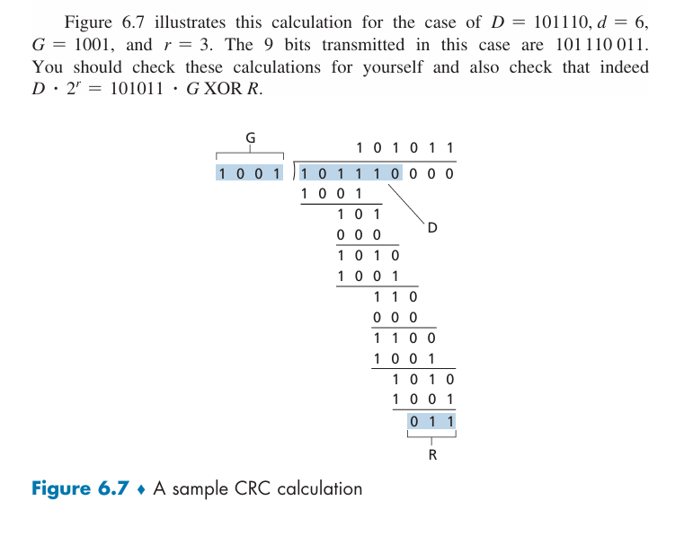
也就是说，规定的这里是r=4位的G，那么就先把数据D左移r-1=3位，然后除以G，最后剩下的余数就是R，过程中所有加减法不进位不借位

## 多路访问链路和协议
网络链路可以分为点对点链路和广播链路两种
- 点对点链路：单个发送方和单个接收方
- 广播链路：多个发送方和接收节点，任何一个节点传输一个帧，信道就会广播，每个节点都会收到一个副本

如何协调多个发送和接受节点对一个共享的广播信道的访问？这就是**多路访问问题**
计算机通过**多路访问协议**来规范共享的广播信道上的传输行为
节点是发送设备也是接收设备，所有节点都能传输帧，所以可以同时接收到多个帧，在接收方**碰撞**
碰撞的时候，所有的帧丢失
多路访问协议可以分为三种：信道划分协议、随机接入协议和轮流协议

### 信道划分协议
时分多路复用(TDM)和频分多路复用(FDM)是两种用于在所有共享信道之间划分广播信道带宽的技术

假设一个信道支持N个节点，并且传输速率为Rbps
TDM把时间划分为时间帧，把每个时间帧划分为N个时隙(这个帧不是链路层的数据单元，二者是不同概念)，然后把每个时隙分配给N个节点中的一个
某个节点要发送分组的时候，就在TDM帧给他指派的时隙内传输分组的bit
也就是说，TDM规则使得每个节点在固定的时间段传输，然后再允许另外一个节点同样的时间长度
这样他避免了碰撞并且很公平，每个节点得到了R/N的平均速率
但是节点被限制于这个平均速率，即使他是唯一有分组要发送的节点，并且必须要等待轮到他才能传输

FDM把Rbps的信道划分为N个不同频段，每个频段有带宽R/N，然后给N个节点每个分配一个频率
所以FDM创建了N个比较小的R/N信道。他的优缺点和TDM是一致的
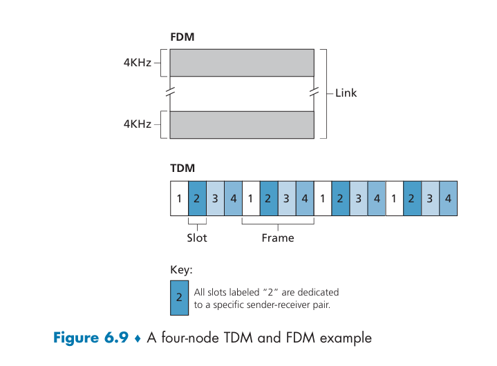

还有一种信道划分协议是码分多址(CDMA)，TDM和FDM为节点分配时隙和频率，而CDMA为每个节点分配一种**编码**，每个节点用他唯一的编码来对他发送的数据进行编码。
所以不同的节点可以同时传输，只要接收方知道发送方的编码

### 随机接入协议
随机接入协议中，一个传输节点总是以信道的全部速率Rbps发送，发生碰撞时，每个涉及碰撞的节点都重发他的帧直到这个帧无碰撞通过。不是立刻重发帧，而是等待一个随机时延之后重发，每个节点独立选择随机时延

#### 时隙ALOHA
做如下假设
- 所有帧由L个比特组成
- 时间被划分为长度为L/R秒的时隙，也就是一个时隙是传输一帧的时间
- 节点只在时隙起点时开始传输帧
- 节点是同步的，每个节点知道时隙什么时候开始
- 如果在一个时隙中有碰撞，那么所有节点在时隙结束之前检测到该碰撞
p是一个概率，在每个节点，时隙ALOHA的操作是
- 如果节点有一个新的帧要发送，那么在下一个时隙开始传输
- 如果没有碰撞，那么帧成功传输，不需要考虑重传
- 如果有碰撞，那么在时隙结束之前检测到，以p的概率在后面的每个时隙重传，直到该帧无碰撞的传出去
所有涉及碰撞的节点独立的抛这个有p概率重传的硬币

因此，他有许多优点。如果某个节点是当前唯一活跃节点，那么他可以全速R连续传输。并且他高度分散，因为每个节点独立决定什么时候重传

我们知道，如果有多个活跃节点，那么一部分时隙会发生碰撞，没有碰撞的时隙只有那些恰好有一个节点传输的时隙
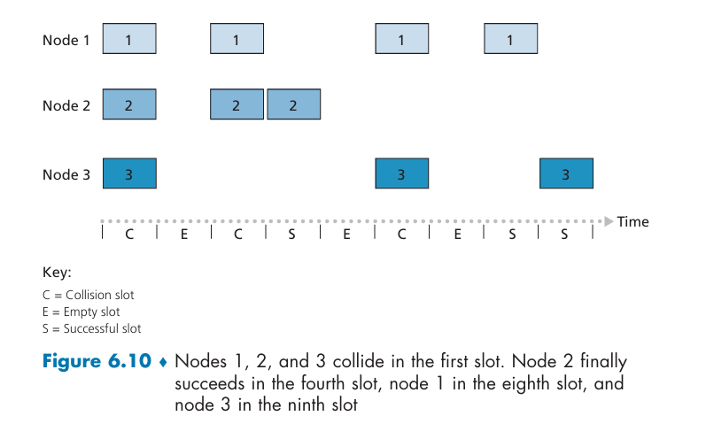
**效率**这里定义为有大量活跃节点并且每个活跃节点有大量帧要传输的时候，成功时隙的份额
显然，如果每个节点都在碰撞之后立刻重传，这个效率是0
那么时隙ALOHA效率如何？
$Np(1-p)^{N-1}$，求导可以知道最大效率在$p=1/N$时候取得，这个时候最大效率是1/e=0.37
所以有效的传输速率不是Rbps而是0.37Rbps

#### ALOHA
时隙ALOHA要求所有节点同步传输，而ALOHA实际上是非时隙的、完全分散的协议。
当一个帧首次到达，节点立刻把这个帧完整传输进广播信道，如果碰撞，那么以p的概率重传，否则等待一个帧的传输时间之后再次丢硬币
纯ALOHA的效率如何？
只有时隙ALOHA的一半。

#### 载波侦听多路访问(CSMA)
在ALOHA中，一个节点的传输和其他节点是独立的。这样不礼貌！
有礼貌的规则：
- 说话之前先听。这是**载波侦听**，一个节点在传输之前先听信道
- 如果和他人同时开始说话，停止说话。这是**碰撞检测**，如果他检测到另外一个节点正在传输一个干扰帧，他就停止传输
这两个规则包含在CSMA和CSMA/CD中。
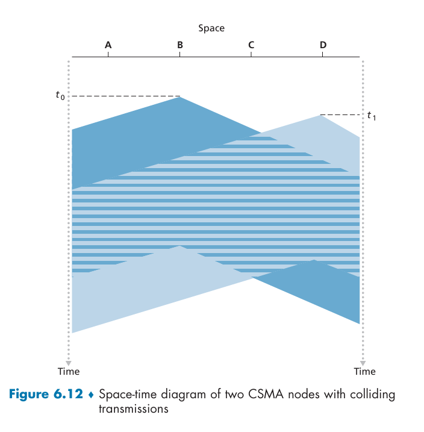
在t0时刻，B发现信道空闲于是开始传输，在t1时刻，B的bit还没有到达D，所以D认为信道空闲，开始传输
但是B的传输开始在D干扰D的传输了，显然信道传播时延越长，载波侦听的节点越难听到另一个节点已经开始传输

#### 具有碰撞检测的CSMA(CSMA/CD)
没有碰撞检测的CSMA，即使出现碰撞，B和D依旧继续传输。这样不对
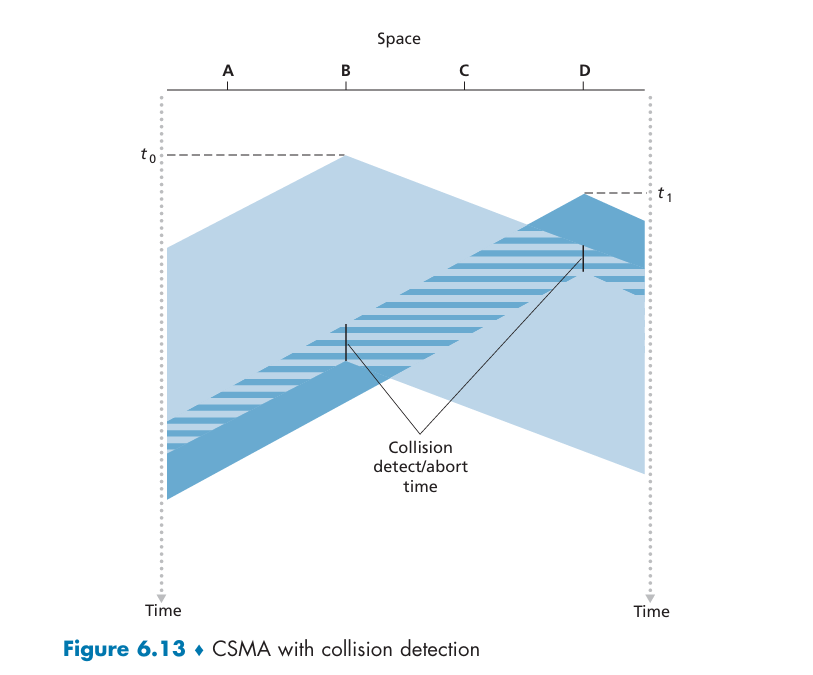
在B的bit到达D和D的bit到达B时，他们检测到了碰撞，从而放弃传输
节点中的适配器与广播信道相连，他的动作：
1. 从网络层获得一个数据报，封装成帧，放入适配器缓存
2. 适配器侦听到信道空闲，那么开始传输，否则等待
3. 传输过程中，看是否有其他适配器的信号
4. 如果没有，那么完成传输，否则终止传输
5. 传输如果终止，等待一个随机时间量，然后重复步骤2.

这个随机等待的时间量应该是多少？
用**二进制指数后退算法**：当该帧经历了一连串的n次碰撞之后，节点从{0, 1, 2, 3, ... 2^n -1}中随机选择一个K
所以K的集合呈现一个指数增长。
有可能在该节点的其他帧在指数后退（等待）的时候，来了一个新的帧，正好成功发送，无碰撞

## 交换局域网
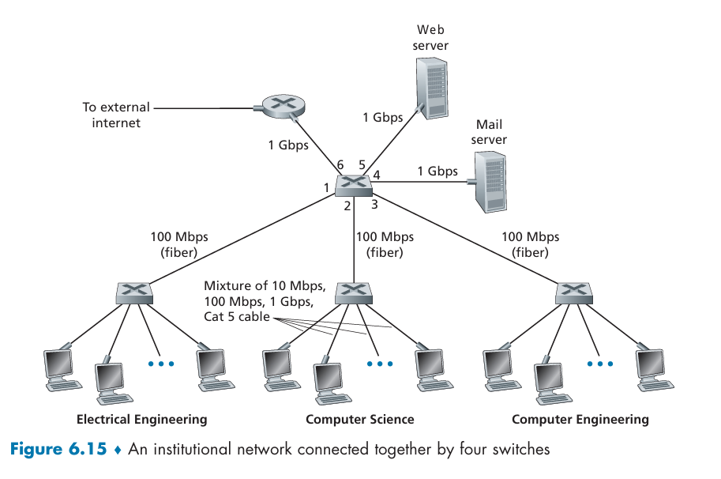
这是一个交换机，与路由器不同，他交换的是链路层帧，他们使用链路层地址

### 链路层寻址和ARP
#### MAC地址
并不是主机或者路由器有链路层地址，而是他们的适配器（网络接口）有链路层地址
所以有多个网络接口的主机或者路由器有多个链路层地址
链路层交换机的接口没有链路层地址，因为交换机的任务是承载数据报
MAC地址长度为6字节，常用16进制表示法，每个字节是两个16进制数
没有两块适配器有相同的MAC地址，MAC地址是扁平结构，不像IP地址是层次结构
MAC地址像人的身份证号，不会改变并且是扁平结构；IP地址像邮政地址，有层次并且搬家的时候会改变
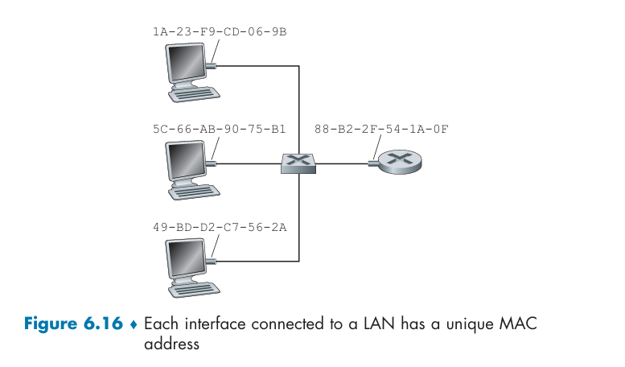
适配器要给另外一个适配器发生帧时，把目的适配器的MAC地址插入到帧里，然后发到局域网
当然，实际上是广播，接收到帧的适配器检查目的MAC地址与自己的是否一致，如果一致就取出数据报并且向上层传递，否则丢弃该帧
如果确实想广播，广播地址是FF-FF-FF-FF-FF-FF

#### 地址解析协议(ARP)
需要网络层地址和链路层地址的转换，这是ARP的任务
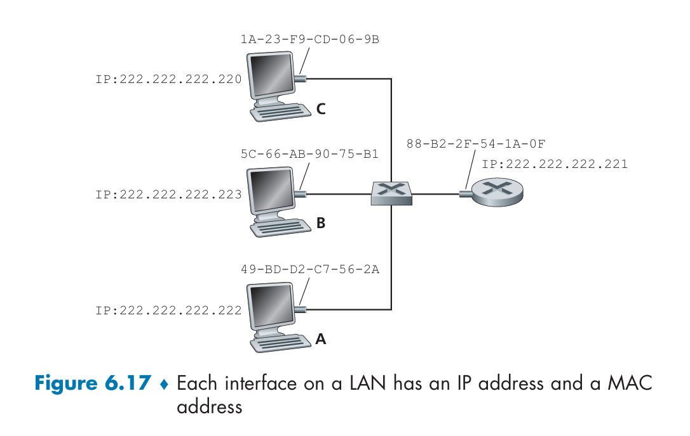
现在我们假设IP地址末尾是220的这个主机要向222主机发送IP数据报
这时，源和目的在同一个子网中，源向他的适配器提供IP数据报和222主机的MAC地址，然后适配器封装一个帧并且发到局域网里面
但是220主机如何确定222主机的MAC地址？
用ARP！有点像DNS，DNS把主机名解析成IP地址，ARP把IP地址解析成MAC地址
但是这两个的区别是，ARP只解析同一个子网里面的IP地址，而DNS可以解析全球的

ARP如何工作？
用ARP表，包含了IP地址到MAC地址的映射
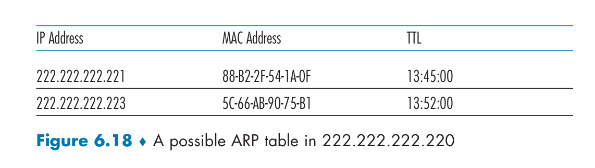
这是220主机里面的一个ARP表

如果发送方有目的主机的MAC地址在ARP表里面，那么是很简单的，但是如果没有？
用ARP协议来解决
发送方构造一个ARP分组，查询分组和相应分组都有相同格式，包括了发送和接受的IP和MAC地址
具体来讲，220主机向他的适配器发送一个ARP查询分组，并且指示适配器用MAC广播地址来发送，然后每个适配器收到之后就会交给ARP模块，ARP模块检查自己这个主机的IP地址和ARP查询分组需要的IP地址是否一样，如果匹配就发一个ARP响应分组
所以ARP查询分组在一个广播帧中，而响应分组在一个普通帧中

#### 发送数据到子网以外
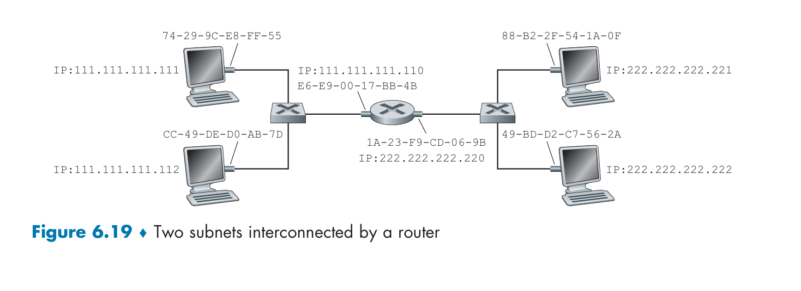
比如这个由两个子网组成，假如主机111向222要发送一个IP数据报
首先111把数据报发给他的适配器，但是目的MAC地址如何指配？
如果直接用222的MAC地址，由于他和子网1的所有MAC地址都不匹配，这个帧就会去天国
我们如果要让数据报去222，必须经过路由器，所以对这个帧来说，他的目的MAC地址应该是路由器接口110的MAC地址
这个MAC地址如何获得？用ARP
然后，适配器把这个帧发给路由器的左接口，那么如何从路由器移动到目的地？
查询路由器转发表，路由器知道了应该要发到接口220，然后220的适配器再封装成帧，然后发给222的MAC地址，因为现在他们是同一个子网了

### 以太网
以太网是一种广播局域网，所有传输的帧会广播到与这个总线连接的所有适配器
以太网用星型拓扑，交换机位于中间

#### 以太网帧结构
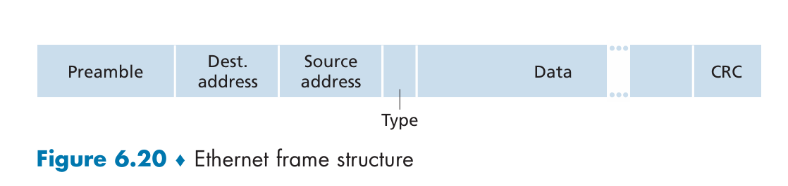
- 数据：承载了IP数据报
- 目的地址/源地址：MAC地址
- 类型：允许复用协议
- CRC：检测
- 前同步码：唤醒接收适配器，把时钟同步
以太网技术是无连接的，不可靠的，如果没有通过CRC就只是丢弃而不通知发送方

#### 以太网技术
以太网是链路层也是物理层的规范，T是双绞铜线

### 链路层交换机
#### 过滤和转发
过滤是决定一个帧应该转发到某个接口还是应该丢弃，转发是决定他要被导向哪个接口
这两个功能借助于**交换机表**，他的一个表项包含：MAC地址，通往该地址的交换机接口和表项放置的时间
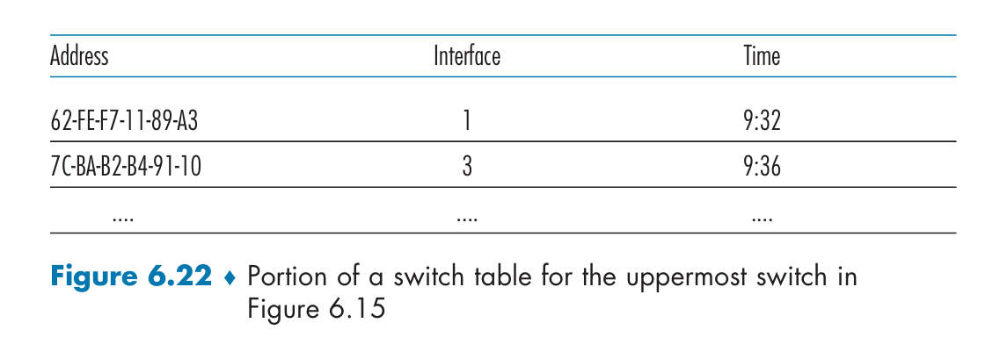
现在我们假设目的地址是DD-DD-DD-DD-DD-DD的帧从交换机的接口x到达，交换机查看他的表
- 如果没有对应的表项，那么向除了x以外的所有接口广播这个帧（的副本）
- 如果有对应的表项，接口是x，那么这个帧是从他的局域网来的，无需转发，直接丢弃
- 如果表项里面的接口不是x而是y，那么需要转发到接口y，放到接口y的输出缓存

#### 自学习
交换机的表是自动建立的，不需要人为干涉
为什么？
1. 交换机表初始是空的
2. 对于每个接口收到的每个入帧，交换机在表中存储：该帧的MAC地址，该帧到达的接口，当前时间
3. 如果在一段时间（老化期）后，交换机没有接收到以该地址为原地址的帧，就把这个地址删掉

#### 链路层交换机的性质
- 消除碰撞
- 异质的链路
- 管理